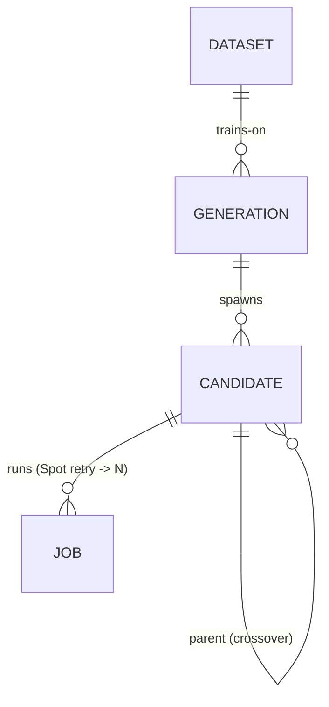

# PRD — AutoResearch 기반 EDA Surrogate 모델 자동 연구

> status: draft (2026-05-29 피벗)
> 설계 lineage(brainstorming 전문): [`docs/superpowers/specs/2026-05-29-autoresearch-eda-surrogate-pivot-design.md`](docs/superpowers/specs/2026-05-29-autoresearch-eda-surrogate-pivot-design.md)
> 외부 구조 참조: [karpathy/autoresearch](https://github.com/karpathy/autoresearch) · [roboco-io/serverless-autoresearch](https://github.com/roboco-io/serverless-autoresearch)

## 1. 문제

전체 RTL→GDSII 공정을 다중 에이전트로 운영하는 3-layer 프로그램은 Operator 1명이 6개월에 끝내기엔 범위가 과도하다. 대상을 **하나의 EDA 서브태스크**로 축소한다.

## 2. 목표 (한 줄)

karpathy AutoResearch의 population-based evolution 루프(serverless-autoresearch HUGI 패턴)를 **EDA surrogate 지표예측 모델 학습**에 적용한다. 에이전트는 학습 스크립트 한 파일만 변형하고, 고정 예산으로 학습 후 단일 val 지표로 keep/discard하며, **Operator가 세대 winner 선택을 감독**한다.

## 3. 범위

- **In**: surrogate 모델(합성 직후 feature → 최종 PPA/routability 예측), 데이터는 기존 EDA flow 1회 실행으로 자가생성, 진화 루프(세대·후보·Spot job·selection).
- **Out (1차)**: process novelty 증거 평면(reasoning trace·decision·finding)은 **2차 세대로 연기**(폐기 아님). 전체 공정 운영, parameter sweep 단독.
- **유지**: Operator 감독(머지 항상 사람), 오픈소스만, reversible patch.

## 4. 데이터 모델 (최소 4-엔티티 ERD)



| 엔티티 | 핵심 속성 |
|---|---|
| **DATASET** | id, source_design, feature_set, label_metric, s3_uri, flow_lockfile_sha |
| **GENERATION** | id, gen_no, baseline_ref, status, winner_candidate_id |
| **CANDIDATE** | id, gen_id(FK), strategy, patch_ref, parent_id(FK self), is_winner, artifact_uri, git_tag |
| **JOB** | id, candidate_id(FK), spot_status, val_metric, train_time, cost, log_uri |

## 5. 리포지토리 구조 (serverless-autoresearch 정렬)

```
├── PRD.md                 # 본 문서
├── prepare.py             # EDA 데이터셋 준비 (read-only, 사람 유지)   [placeholder]
├── train.py               # surrogate 학습 (에이전트가 변형하는 단일 파일) [placeholder]
├── program.md             # 에이전트 baseline 지시문                  [placeholder]
├── config.yaml            # AWS/파이프라인 설정                      [placeholder]
├── src/pipeline/          # orchestrator · candidate_gen · batch_launcher · result_collector · selection
├── src/sagemaker/         # entry / training wrapper
├── data/raw/              # 데이터 참조 (실데이터는 S3)
├── experiments/           # 세대별 리포트
├── models/                # 학습 artifact
└── docs/superpowers/specs/ # 설계 lineage
```

## 6. 결정 보류 (issues 후보)

surrogate 지표 정의, feature_set 구성, 데이터 규모, 모델 클래스(tabular vs GNN), INTENT.md 재작성 범위 — 설계 spec §8 참조.
