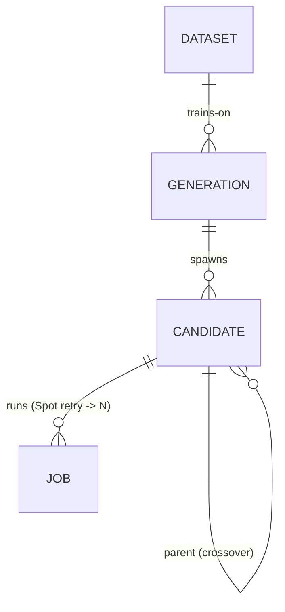

# PRD — AutoResearch 기반 EDA Surrogate 모델 자동 연구

> status: draft (2026-06-04, INTENT 기반 재작성) · 결정 수준: **요구사항 레벨** (기술 결정 3종은 §10 Open Decisions로 격리)
> 근거: [`INTENT.md`](INTENT.md) (status: exploring) — 본 PRD의 모든 요구는 INTENT `Why·What·Not`에서 파생.
> 설계 lineage(brainstorming 전문 + 구조 치환): [`docs/superpowers/specs/2026-05-29-autoresearch-eda-surrogate-pivot-design.md`](docs/superpowers/specs/2026-05-29-autoresearch-eda-surrogate-pivot-design.md)
> 외부 구조 참조: [karpathy/autoresearch](https://github.com/karpathy/autoresearch) · [roboco-io/serverless-autoresearch](https://github.com/roboco-io/serverless-autoresearch)
> 이전 의도/구현(통합 프로그램 3-layer)은 `archive/integrated-program-3layer` 브랜치에 보존.

---

## 1. 배경 · 문제 (INTENT `Why`)

- EDA surrogate 모델(합성 직후 feature → 최종 PPA/routability 예측)은 **성숙한 분야**다 — CircuitNet 2.0, RouteNet, Net2, MasterRTL/SNS, "Circuit as Set of Points"(NeurIPS 2023). 그러나 모델 구조·하이퍼파라미터·feature 설계의 **탐색 루프는 여전히 사람이 수작업**한다. 이 루프는 기계적이다.
- karpathy AutoResearch는 "research를 search로 환원"해 이 루프를 에이전트에 위임했으나 대상은 **LLM 학습**이고, EDA surrogate 학습에 적용된 사례는 없다.
- AutoResearch와 그 형식화 [AutoResearch-RL](https://arxiv.org/abs/2603.07300)의 명시적 전제는 **no human in the loop** ("human might be asleep, you are autonomous"). 비전문가 Operator가 다중 에이전트를 *감독*하며 EDA surrogate 연구를 수행할 수 있는지, 그 감독이 자율 무인보다 재현성·신뢰성에서 나은지에 대한 사례는 부재.

**메타 목적** (INTENT 유지): (1) 의도공학(intent engineering) 패러다임 우수성의 사례 연구, (2) Operator 학습 ↔ 프로젝트 진화의 co-evolution.

## 2. 목표 · 가설 (INTENT `Why`)

**목표 (한 줄)**: karpathy AutoResearch의 population-based evolution 루프(serverless-autoresearch HUGI 패턴)를 **EDA surrogate 지표예측 모델 학습**에 적용한다. 에이전트는 학습 스크립트 한 파일만 변형하고, 고정 예산으로 학습 후 단일 val 지표로 keep/discard하며, **Operator가 세대 winner 선택을 감독**한다.

**가설**:
- **H-A** — AutoResearch 진화 루프를 EDA surrogate 학습에 적용하면 사람-수작업 탐색보다 더 나은 surrogate(낮은 val 지표)를 적은 노력으로 얻는다.
- **H-B** — 자율 무인 대신 **Operator-in-loop**(winner 선택·머지는 항상 사람)를 유지해도 성능을 잃지 않으며, reasoning trace 누적(2차 연기)으로 재현성·신뢰성에서 차별화된다.

**확인 방법**:
- 고정 데이터셋 위에서 루프 winner의 val 지표를 사람-수작업 baseline과 비교 (낮으면 H-A 지지).
- Operator-in-loop 구성이 자율 무인 대비 성능 손실 없이 winner를 선택하는지 세대 로그로 확인 (H-B).
- 정확한 비교 baseline·지표 임계값은 **데이터셋 확정 후 spec에서 nail down** → §10 Open Decisions.

> **권한 주의** (INTENT-vs-spec invariant): 본 PRD는 정량 임계값을 *재정의하지 않는다*. 임계값은 데이터셋 확정 후 설계 spec에 고정되며, PRD는 그것을 인용만 한다.

## 3. 운영 모델 · 페르소나

**single-operator multi-agent**. 사용자는 **Operator(감독자)** — Researcher/Developer 역할은 에이전트가 수행하고, **머지·winner 선택은 항상 Operator**. 에이전트의 자율성은 후보 *생성·학습*까지이며, *채택*은 사람의 권한이다 (H-B의 핵심 차별 축).

## 4. 기능 요구사항 (INTENT `What` → FR)

| ID | 요구 | INTENT 출처 | 인수 기준 (요구 레벨) |
|---|---|---|---|
| **FR-1** | **데이터셋 자가생성** — `prepare.py`가 오픈소스 EDA flow 1회 실행으로 feature(합성 직후) + label(최종 PPA/routability) 쌍을 생성하고 `DATASET.flow_lockfile_sha`로 재현성을 앵커한다. | What §핵심기능 1 | flow lockfile SHA가 기록되고, 동일 SHA로 데이터셋이 재생성된다. (feature_set·label 정의는 §10) |
| **FR-2** | **후보 생성** — 세대당 N개의 `train.py` 변형 후보를 전략 다양화(conservative/moderate/aggressive/crossover)로 생성한다. 각 후보는 reversible patch(`CANDIDATE.patch_ref`)다. | What §핵심기능 2 / spec §5.1 | 한 세대에서 N개 후보가 서로 다른 patch로 생성되고, baseline에서 복원 가능하다. |
| **FR-3** | **병렬 학습 실행** — 후보를 병렬 Spot 학습 job으로 제출하고(HUGI), 고정 예산 내에서 단일 val 지표를 산출한다. | What §핵심기능 2 / spec §5.2 | 후보 N개가 병렬 실행되고 각 JOB이 `val_metric`을 반환한다. |
| **FR-4** | **Selection** — 최저(또는 최선) val 지표 winner를 식별해 Operator에게 제시한다. | What §핵심기능 2 / spec §5.4 | 세대 종료 시 winner 후보 1개와 전체 순위가 제시된다. |
| **FR-5** | **Operator 감독 인터페이스** — winner 채택·머지는 항상 사람이 수행하며, 승인 시 `gen-NNN-best` git tag로 commit하고 세대 카운터를 증가시킨다. | What §핵심기능 3 / Not §절대금지 | Operator 승인 없이 winner가 자동 머지되지 않는다. 승인 시에만 tag·다음 세대 baseline이 갱신된다. |
| **FR-6** | **(연기) reasoning trace 증거 평면** — 후보별 hypothesis/observed effect를 누적한다. **2차 세대**. | What §핵심기능 4 | 1차 범위 밖 — §11. |

**사용자 흐름** (INTENT `What`):
1. Operator가 `program.md`(지시문)·`config.yaml`(예산·세대수·population 크기) 설정.
2. 에이전트가 `train.py` 변형 후보 N개 생성·병렬 학습.
3. 루프가 val 지표로 winner 후보 제시.
4. Operator가 검토·승인·git tag commit → 다음 세대 baseline.

**엣지 케이스** (INTENT `What`):
- Spot 회수 시 job 재시도 (`CANDIDATE` 1:N `JOB`).
- 후보가 데이터 누수/과적합으로 val 지표만 좋은 경우 → Operator 거절 (+연기된 trace에 기록).
- surrogate 지표가 복수일 때(slack vs area vs routability) 단일화 방법 → §10.

## 5. 비기능 요구사항 · 제약 (INTENT `Not` 기술제약)

| ID | 제약 | INTENT 출처 |
|---|---|---|
| **NFR-1** | 에이전트는 `train.py` **단일 파일만** 변형. 신규 의존성 금지. 고정 학습 예산 (AutoResearch 제약 계승). | Not §기술제약 |
| **NFR-2** | `prepare.py`(데이터·평가 프로토콜)는 **frozen** — 에이전트 변경 금지 (공정 비교 보장). | Not §절대금지 |
| **NFR-3** | 오픈소스 EDA 도구만 (OpenROAD/Yosys 등). 상용 도구 금지. | Not §절대금지 |
| **NFR-4** | Python 3.12, uv. ruff 100 char, target-version py312. | Not §기술제약 |
| **NFR-5** | Direct commit to `main` (현재 워크플로). reversible patch 유지. | Not §기술제약 |
| **NFR-6** | functional correctness를 surrogate 예측으로 주장하지 않는다 (surrogate는 근사). | Not §절대금지 |

## 6. 범위 밖 (INTENT `Not` 범위밖)

- 전체 RTL→GDSII 공정 운영 (`archive/integrated-program-3layer`로 분리).
- Parameter sweep 단독 (ORFS-agent 영역) — 본 프로젝트는 surrogate **모델 학습**의 자동 연구.
- 모바일·웹 UI, 다중 사용자.
- 자율 무인 루프로 winner 무검토 머지 (AutoResearch-RL의 *no-human* 전제 불채택 — Operator authority).

## 7. 데이터 모델 (최소 4-엔티티 ERD, spec §6)



| 엔티티 | 핵심 속성 | 역할 |
|---|---|---|
| **DATASET** | id, source_design, feature_set, label_metric, s3_uri, **flow_lockfile_sha** | flow 1회로 생성된 고정 라벨셋. `flow_lockfile_sha`가 재현성 앵커 (FR-1). |
| **GENERATION** | id, gen_no, baseline_ref, status, winner_candidate_id | 진화 1세대 (FR-4). |
| **CANDIDATE** | id, gen_id(FK), strategy, **patch_ref**, parent_id(FK self), is_winner, artifact_uri, git_tag | 변형된 학습 스크립트 1개 = reversible patch (FR-2). winner artifact 흡수. |
| **JOB** | id, candidate_id(FK), spot_status, **val_metric**, train_time, cost, log_uri | Spot 실행 1회 (회수 시 candidate당 1:N) (FR-3). RESULT 흡수. |

축소 근거: RESULT→JOB, MODEL_ARTIFACT→CANDIDATE 흡수로 6→4 엔티티. `CANDIDATE.parent_id`(self-ref) 계보가 연기한 reasoning trace의 **부착점**.

## 8. 리포지토리 구조 (serverless-autoresearch 정렬)

```
├── PRD.md                 # 본 문서
├── prepare.py             # EDA 데이터셋 준비 (read-only / frozen — NFR-2)   [placeholder]
├── train.py               # surrogate 학습 (에이전트 변형 단일 파일 — NFR-1)  [placeholder]
├── program.md             # 에이전트 baseline 지시문                       [placeholder]
├── config.yaml            # AWS/파이프라인 설정 (region/Spot/세대수/N)        [placeholder]
├── src/pipeline/          # orchestrator · candidate_gen · batch_launcher · result_collector · selection
├── src/sagemaker/         # entry / training wrapper
├── data/raw/              # 데이터 참조 (실데이터는 S3)
├── experiments/           # 세대별 리포트
├── models/                # 학습 artifact
└── docs/superpowers/specs/ # 설계 lineage
```

**4-step 루프** (spec §5): Candidate Generation → Batch Launch(병렬 Spot/HUGI) → Result Collection → Selection. winner는 Operator 승인 후 git tag `gen-NNN-best`.

## 9. 성공 기준 (INTENT `품질 기준`)

| 기준 | 조건 | 비고 |
|---|---|---|
| 가설 지지 | surrogate winner val 지표 < 사람-수작업 baseline | 임계값은 §10 (데이터 확정 후 spec). |
| 재현성 | 세대 간 결과 재현 (동일 데이터셋·`flow_lockfile_sha`) | NFR-2가 전제. |
| Operator authority | 자율 무인 대비 성능 손실 없이 winner 선택 (세대 로그) | H-B 검증. |
| (연기) trace 복원 | reasoning trace 복원 가능 | 2차 세대 (§11). |

## 10. Open Decisions ([`issues/`](issues/) 추적 — 본 PRD에 임의 확정 금지, spec §8)

> 사용자 결정: 아래 기술 결정은 **열린 채로 유지**. 데이터셋 확정 후 설계 spec에서 nail down. 본 PRD는 인용만.
> 의존 순서: **OD-1이 선행** — 지표가 정해져야 OD-2~5 확정 가능 (issues/README 참조).

- **OD-1** surrogate 지표 정의 — slack vs area vs routability, 단일 vs 복합 (FR-1·FR-3·§9 임계값). → [`issues/001`](issues/001-surrogate-metric-definition.md)
- **OD-2** feature_set 구성 — 합성 리포트 어느 필드까지 (FR-1). → [`issues/002`](issues/002-feature-set-composition.md)
- **OD-3** 데이터 규모 — flow 1회 실행으로 충분한 라벨 수 확보 가능 여부 (FR-1). → [`issues/003`](issues/003-dataset-scale-label-count.md)
- **OD-4** 모델 클래스 — tabular regression vs GNN, CPU 학습 가능성 (NFR-1·`train.py`). → [`issues/004`](issues/004-model-class-tabular-vs-gnn.md)
- **OD-5** 비교 baseline·정량 임계값 — §9 가설 지지 조건 (데이터 확정 후 spec, INTENT-vs-spec invariant). → [`issues/005`](issues/005-comparison-baseline-thresholds.md)

## 11. 연기 항목 (2차 세대, 폐기 아님 — spec §7)

publish 축인 process novelty 증거 평면은 1차 ERD에서 제외하되 폐기하지 않는다. `CANDIDATE.parent_id` 계보가 부착점:
- **REASONING_TRACE** (candidate별 hypothesis/expected·observed effect/judge_score) — H3 증거.
- **DECISION** (Operator keep/discard/reframe + rationale) — Operator 권한.
- **FINDING** (누적 재사용 통찰 + confidence tier) — 재사용.
