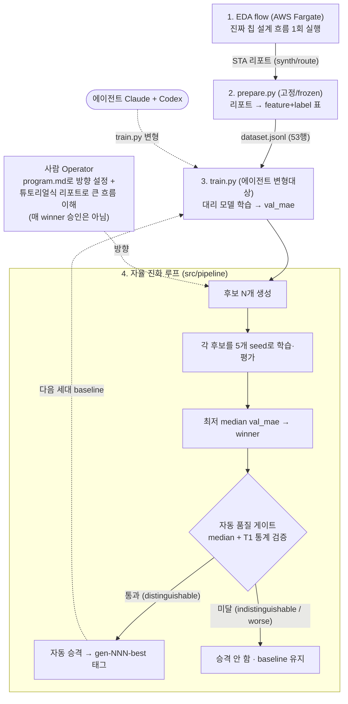

# semiconductor-design — 비전문가가 자율 AI로 반도체 타이밍 모델을 *연구*하다

> **AutoResearch for EDA Surrogate Models.** AI 에이전트가 반도체 타이밍 예측(surrogate) 모델을
> **스스로 연구**하고, **객관적인 자동 품질 게이트**가 채택을 판정한다. 사람(Operator)은 *방향을
> 잡고 큰 흐름을 이해*할 뿐 — 매 winner에 승인 도장을 찍지 않는다.
>
> 🎯 **진짜 목표**: 반도체 전문가가 아닌 사람도 자율 에이전트를 *방향만 잡아 부려서* 전문영역에서
> 의미있는 성과를 내는 것.
>
> 📖 **EDA 배경 지식이 없어도 됩니다** — [`docs/TUTORIAL.md`](docs/TUTORIAL.md)에서 용어를 하나하나
> 풀어 설명합니다. **처음이라면 거기부터** 읽으세요. 이 README는 한눈에 보는 요약입니다.

karpathy [AutoResearch](https://github.com/karpathy/autoresearch)의 진화 루프를 **EDA surrogate
지표예측 모델 학습**에 적용한다. 구조는
[roboco-io/serverless-autoresearch](https://github.com/roboco-io/serverless-autoresearch) 패턴을 따른다.

> 2026-05-29 EDA surrogate로 피벗 · **2026-06-08 재피벗**(Operator authority → 비전문가 empowerment +
> 이해가능성). 이전 통합 프로그램(L1/L2/L3 3-layer)은 `archive/integrated-program-3layer` 브랜치에 보존.

## 한 문단 요약

칩을 설계할 때 "이 회로가 충분히 빠른가"를 확인하려면 **느린 시뮬레이션**을 끝까지 돌려야 합니다.
이걸 매번 돌리는 대신 결과를 빠르게 *예측*하는 **AI 대리 모델(surrogate)** 을 만들 수 있는데, 그
모델을 잘 만드는 일 자체가 **지루한 반복 노동**입니다. 이 프로젝트는 그 반복을 **AI 에이전트에게
통째로 맡겨 자율적으로**(Karpathy의 AutoResearch처럼) 더 나은 모델을 찾게 합니다. 채택 여부는
**객관적인 자동 게이트**가 판정하고, 사람은 *방향*과 *큰 흐름*만 봅니다.

## 전체 흐름



자세한 4개 조각(EDA flow · `prepare.py` · `train.py` · 진화 루프) 설명은
[`docs/TUTORIAL.md` §4](docs/TUTORIAL.md#4-시스템-구성--4개의-조각).

## 무엇을, 왜

- **목표**: 합성 직후 정보(feature) → 최종 타이밍 슬랙(label)을 예측하는 **대리(surrogate) 모델**을,
  AI 에이전트가 학습 스크립트(`train.py`)를 반복 변형하며 자동으로 더 잘 학습.
- **루프**: 세대마다 N개 후보 변형(Claude+Codex) → 각각 **5개 seed로 학습** → 최저 **median val_mae**
  winner → **객관적 자동 게이트(median + T1 검증) 통과 시 자동 승격**(`gen-NNN-best` 태그).
- **차별 축(가설, 2026-06-08 재피벗)**:
  - **H-A** — 에이전트 루프가 사람 수작업을 능가한다. *(gen-001에서 엄밀 통계로 확증 — 아래.)*
  - **H-B(재정의)** — 비전문가가 *per-winner 승인 없이* 방향·큰 흐름만 이해해도 자율 루프가 신뢰할
    수 있는 성과를 낸다. 이를 가능케 하는 건 **객관적 자동 게이트 + 튜토리얼식 이해가능성**이다.
    *(novelty 축이 Operator authority → 비전문가 empowerment로 이동.)*

## 지금까지 (2026-06-08)

✅ **시스템 functional · 2세대 실증 · 평가 프로토콜이 스스로 진화.** (자세히는 [`INTENT.md`](INTENT.md) Learnings)

| 조각 | 파일 | 상태 |
|---|---|---|
| EDA flow (클라우드) | `cdk/`, `docker/eda-flow*` | ✅ AWS Fargate 배포·검증 (진짜 데이터 53행 확보) |
| 데이터 준비 (고정) | `prepare.py`, `src/prepare_lib/` | ✅ frozen 계약 |
| 학습 스크립트 (변형대상) | `train.py` | ✅ sklearn Gradient Boosting baseline |
| 자율 진화 루프 | `src/pipeline/` | ✅ candidate_gen·runner·**multi-seed median**·selection·**T1 검증 게이트**·operator_gate·orchestrator (59 tests) |
| **gen-001** | tag `gen-001-best` | ✅ 승격 · **H-A 엄밀 재확증**(winner 0.148 vs 사람 baseline 0.194, dz=−1.27, p<0.001 → verdict `distinguishable`) |
| **gen-002** | `experiments/gen-002/` | ❌ **reject** — 단일 seed winner가 5-seed median에선 baseline에 패배(위양성) |

> 🧪 **이 프로젝트의 가장 값진 발견은 "측정의 엄밀함"입니다.** gen-002에서 단일 seed 선택이 *운 좋은*
> 위양성 winner를 뽑은 걸 계기로, 채점을 **5-seed median → 50-fold 통계 검증(T1 게이트)** 으로 강화했고,
> 그 엄밀한 게이트가 gen-001의 H-A를 오히려 *재확증*했습니다. 운영하며 배운 게 시스템을 바꾸고, 바뀐
> 시스템이 다시 결론을 단단히 만든 **co-evolution**의 실제 사례입니다. → [`docs/TUTORIAL.md` §5·§6](docs/TUTORIAL.md#5-실제로-무슨-일이-일어났나-gen-001-결과)

> 🔧 **전환 중**: 자율 *자동 승격* 코드(`operator_gate` → auto-gate)는 다음 작업입니다. 현재는
> Operator가 게이트 리포트를 확인하고 머지하는 임시 단계가 남아 있습니다(방향은 INTENT에 확정).

## 빠른 시작

```bash
make install                         # 의존성 설치
make test                            # 59 tests
make lint                            # 코드 스타일 검사

# (1) 진짜 데이터 → 표(53행)
uv run python prepare.py --synth experiments/real-gcd-fargate/synth.rpt \
  --route experiments/real-gcd-fargate/route.rpt \
  --lockfile experiments/real-gcd-fargate/versions.txt \
  --design-id gcd --out-dir /tmp/ds

# (2) 대리 모델 1회 학습
make train DATA=/tmp/ds/dataset.jsonl OUT=/tmp/art SEED=0

# (3) 진화 1세대 — claude/codex CLI 호출(구독 사용량 소모, 추가 LLM 과금 없음). 5-seed median으로 winner
make loop GEN=3 DATASET=/tmp/ds/dataset.jsonl N=2 PROGRAM=program.md
```

검증 게이트 실행 등 더 많은 명령은 [`docs/TUTORIAL.md` §8](docs/TUTORIAL.md#8-직접-해보기-명령어).
클라우드 EDA flow 재실행(AWS 비용)은 [`cdk/DEPLOY.md`](cdk/DEPLOY.md).

## 문서 지도

| 문서 | 내용 |
|---|---|
| [`docs/TUTORIAL.md`](docs/TUTORIAL.md) | **여기부터** — EDA 비전공자용 튜토리얼 + 전체 흐름 + 용어 사전 |
| [`INTENT.md`](INTENT.md) | 프로젝트의 Why/What/Not/Learnings (status: exploring, 2026-06-08 재피벗) |
| [`PRD.md`](PRD.md) | 제품 요구사항 + 데이터 모델(ERD) |
| [`issues/`](issues/) | 결정 기록 OD-1~6 |
| [`docs/superpowers/specs/`](docs/superpowers/specs/) | 단계별 설계 문서 (median harness · T1 검증 게이트 포함) |
| [`docs/superpowers/plans/`](docs/superpowers/plans/) | 단계별 TDD 구현 plan |
| [`experiments/gen-001/revalidation.md`](experiments/gen-001/revalidation.md) | gen-001 H-A 엄밀 재확증 |
| [`experiments/gen-002/rejudge.md`](experiments/gen-002/rejudge.md) | gen-002 위양성 → reject |

## 개발 규약

Python 3.12 · uv · ruff(100 char) · pytest. `main`에 직접 커밋. 에이전트가 변형하는 `train.py` 외의
substrate(`prepare.py`, 평가 규칙)는 **고정(frozen)** — 공정 비교를 위해. winner 승격은 **객관적 자동
게이트(median + T1)** 가 판정한다(auto-gate 미구현 동안은 Operator가 게이트 확인 후 머지 — 임시).
