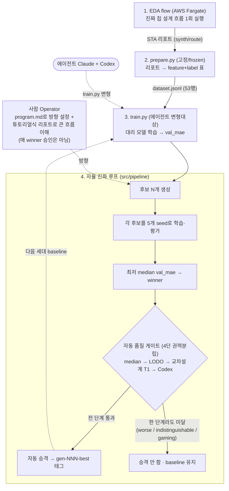

# semiconductor-design — 비전문가가 자율 AI로 반도체 타이밍 모델을 *연구*하다

> **AutoResearch for EDA Surrogate Models.** AI 에이전트가 반도체 타이밍 예측(surrogate) 모델을
> **스스로 연구**하고, **객관적인 자동 품질 게이트**가 채택을 판정한다. 사람(Operator)은 *방향을
> 잡고 큰 흐름을 이해*할 뿐 — 매 winner에 승인 도장을 찍지 않는다.
>
> 🎯 **진짜 목표**: 반도체 전문가가 아닌 사람도 자율 에이전트를 *방향만 잡아 부려서* 전문영역에서
> 의미있는 성과를 내는 것.
>
> 📖 **어디서 시작하나** (둘 다 EDA 배경 지식이 없어도 됩니다):
> - **ML은 알고 *반도체가 처음*인 개발자** → [`tutorial/`](tutorial/) 개념 커리큘럼(5레슨·다이어그램):
>   EDA flow → surrogate → AutoResearch 루프 → 게이트.
> - **EDA 배경이 *전혀 없는* 분** → [`docs/TUTORIAL.md`](docs/TUTORIAL.md): 용어를 하나하나 풀어 쓴
>   프로젝트 서사 + 세대별 결과 + 용어 사전.
>
> 이 README는 한눈에 보는 요약입니다.

> ⚠️ **이 프로젝트의 성격**: 반도체 설계 **비전문가**가 *학습*과 **PoC(개념 증명)**를 위해 진행하는
> 연구입니다. 상용 수준 정확도나 production 사용을 목표로 하지 않으며, 핵심 질문은 "비전문가가 자율
> AI를 *방향만 잡아* 전문영역을 탐구할 수 있는가"입니다. 한계는 아래 [면책 조항](#면책-조항),
> 함께할 분은 [기여 & 참여자 모집](#기여--참여자-모집)을 봐주세요.

karpathy [AutoResearch](https://github.com/karpathy/autoresearch)의 진화 루프를 **EDA surrogate
지표예측 모델 학습**에 적용한다. 구조는
[roboco-io/serverless-autoresearch](https://github.com/roboco-io/serverless-autoresearch) 패턴을 따른다.

> 2026-05-29 EDA surrogate로 피벗 · **2026-06-08 재피벗**(Operator authority → 비전문가 empowerment +
> 이해가능성). 이전 통합 프로그램(L1/L2/L3 3-layer)은 `archive/integrated-program-3layer` 브랜치에 보존.

## 한 문단 요약

칩을 설계할 때 "이 회로가 충분히 빠른가"를 확인하려면 **느린 시뮬레이션**을 끝까지 돌려야 합니다.
이걸 매번 돌리는 대신 결과를 빠르게 *예측*하는 **AI 대리 모델(surrogate)** 을 만들 수 있는데, 그
모델을 잘 만드는 일 자체가 **지루한 반복 노동**입니다. 이 프로젝트는 그 반복을 **AI 에이전트에게
통째로 맡겨 자율적으로**(Karpathy의 AutoResearch처럼) 더 나은 모델을 찾게 합니다. 채택 여부는
**객관적인 자동 게이트**가 판정하고, 사람은 *방향*과 *큰 흐름*만 봅니다.

## 전체 흐름



자세한 4개 조각(EDA flow · `prepare.py` · `train.py` · 진화 루프) 설명은
[`docs/TUTORIAL.md` §4](docs/TUTORIAL.md#4-시스템-구성--4개의-조각).

## 무엇을, 왜

- **목표**: 합성 직후 정보(feature) → 최종 타이밍 슬랙(label)을 예측하는 **대리(surrogate) 모델**을,
  AI 에이전트가 학습 스크립트(`train.py`)를 반복 변형하며 자동으로 더 잘 학습.
- **루프**: 세대마다 N개 후보 변형(Claude+Codex) → 각각 **5개 seed로 학습** → 최저 **median val_mae**
  winner → **객관적 자동 게이트 4단(median → LODO → 교차설계 T1 → Codex) 통과 시 자동 승격**(`gen-NNN-best` 태그).
  게이트는 *생성자 ≠ 판정자* 권력분립 — 한 단계라도 막히면 baseline 유지. 자세히는 [`wiki/gate-chain.md`](wiki/gate-chain.md).
- **차별 축(가설, 2026-06-08 재피벗)**:
  - **H-A** — 에이전트 루프가 사람 수작업을 능가한다. *(gen-001에서 엄밀 통계로 확증 — 아래.)*
  - **H-B(재정의)** — 비전문가가 *per-winner 승인 없이* 방향·큰 흐름만 이해해도 자율 루프가 신뢰할
    수 있는 성과를 낸다. 이를 가능케 하는 건 **객관적 자동 게이트 + 튜토리얼식 이해가능성**이다.
    *(novelty 축이 Operator authority → 비전문가 empowerment로 이동.)*

## 지금까지 (2026-06-21, gen-008)

✅ **시스템 functional · 8세대 자율 진화 · 평가 프로토콜이 스스로 4단 게이트로 진화.** (자세히는 [`INTENT.md`](INTENT.md) Learnings)

| 조각 | 파일 | 상태 |
|---|---|---|
| EDA flow (클라우드) | `cdk/`, `docker/eda-flow*` | ✅ AWS Fargate 배포·검증 — **4개 설계** 데이터(gcd 53 + aes 691 + ibex 2040 + jpeg 4410 = 7194행) |
| 데이터 준비 (고정) | `prepare.py`, `src/prepare_lib/` | ✅ frozen 계약 |
| 학습 스크립트 (변형대상) | `train.py` | ✅ gen-001 winner(VotingRegressor + 도메인 feature 13개) 챔피언. 레퍼런스 [`docs/TRAIN.md`](docs/TRAIN.md) |
| 자율 진화 루프 | `src/pipeline/` | ✅ candidate_gen·runner·**multi-seed median**·selection·**LODO·교차설계 T1·Codex 게이트**·orchestrator (123 tests) |

**세대 기록** (튜토리얼: [`experiments/README.md`](experiments/README.md)):

| 세대 | 결과 | 한 줄 |
|---|---|---|
| gen-001 | ✅ **승격** | H-A 엄밀 재확증(winner 0.148 vs 사람 0.194, dz=−1.27, p<0.001) |
| gen-002 | ❌ reject | 단일 seed winner가 5-seed median에선 꼴찌(위양성) → median 게이트 도입 |
| gen-003 | ❌ rejected_codex | Codex가 평가 누수(검증셋에서 best 모델 cherry-pick) 적발 |
| gen-004–005 | ❌ rejected_lodo | 다설계 혼합 + LODO 도입. median-winner가 미관측 설계서 baseline에 연속 후퇴 |
| gen-006 | ❌ rejected_t1 | LODO 통과↔혼합-T1 충돌 → **T1을 교차설계 통계 게이트로 재정의** |
| gen-007 | ❌ rejected_t1 | LODO(방향성)와 교차설계 T1(통계 유의)의 역할 분담 입증 |
| gen-008 | ❌ rejected_t1 | 4설계(+jpeg)에서도 무승부 — 아래 발견이 5세대째 견고 |

> 🧪 **이 프로젝트의 가장 견고한 발견: "in-loop `val_mae` 개선 ≠ 교차설계 일반화 우위".**
> gen-004~008 다섯 세대 내내 median val_mae는 계속 낮아졌지만(gen-007 1.29 → gen-008 0.53 역대 최저),
> 교차설계 T1은 줄곧 `indistinguishable`이었습니다. **in-distribution 최적화와 미관측 설계 일반화는
> 구조적으로 분리**되며, 단순 재추첨·데이터 추가로는 이 벽을 못 넘습니다. 승격 0건은 실패가 아니라
> 4단 게이트가 *5건의 위양성 승격을 막아* baseline 오염을 방지한 결과입니다 — 운영하며 배운 게
> 게이트를 진화시키고(단일 seed→median→LODO→교차설계 T1→Codex), 진화한 게이트가 다시 결론을
> 단단히 만든 **co-evolution**의 실제 사례. → [`docs/TUTORIAL.md`](docs/TUTORIAL.md) · [`experiments/README.md`](experiments/README.md)

> 🔧 **전환 중**: 자율 *자동 승격* 코드(auto-gate 전환)는 남은 작업입니다. 현재는 Operator가 게이트
> 리포트를 확인하고 머지하는 임시 단계가 남아 있습니다(방향은 INTENT에 확정).

## 빠른 시작

```bash
make install                         # 의존성 설치
make test                            # 123 tests
make lint                            # 코드 스타일 검사

# (1) 진짜 데이터 → 표(53행)
uv run python prepare.py --synth experiments/real-gcd-fargate/synth.rpt \
  --route experiments/real-gcd-fargate/route.rpt \
  --lockfile experiments/real-gcd-fargate/versions.txt \
  --design-id gcd --out-dir /tmp/ds

# (2) 대리 모델 1회 학습
make train DATA=/tmp/ds/dataset.jsonl OUT=/tmp/art SEED=0

# (3) 진화 1세대 — claude/codex CLI 호출(구독 사용량 소모, 추가 LLM 과금 없음). 5-seed median으로 winner
#     다설계 dataset이면 median 뒤 LODO → 교차설계 T1 → Codex 4단 게이트가 자동 판정.
make loop GEN=9 DATASET=experiments/multidesign/dataset-4design.jsonl N=2 PROGRAM=program.md
```

검증 게이트 실행 등 더 많은 명령은 [`docs/TUTORIAL.md` §8](docs/TUTORIAL.md#8-직접-해보기-명령어).
클라우드 EDA flow 재실행(AWS 비용)은 [`cdk/DEPLOY.md`](cdk/DEPLOY.md).

## 문서 지도

| 문서 | 내용 |
|---|---|
| [`tutorial/`](tutorial/) | **ML 개발자용 개념 커리큘럼**(반도체 처음) — 5레슨 + 다이어그램(EDA flow·surrogate·AutoResearch·게이트) |
| [`docs/TUTORIAL.md`](docs/TUTORIAL.md) | **여기부터** — EDA 비전공자용 튜토리얼 + 전체 흐름 + 용어 사전 |
| [`experiments/README.md`](experiments/README.md) | **세대별 튜토리얼 시리즈**(gen-001~008) — 각 세대 전제·방법·결과·분석 |
| [`docs/TRAIN.md`](docs/TRAIN.md) | `train.py` 구현 레퍼런스 — 데이터 흐름·함수·에이전트 변형 가이드 |
| [`wiki/gate-chain.md`](wiki/gate-chain.md) | 4단 권력분립 게이트(median→LODO→교차설계 T1→Codex) 설명 |
| [`INTENT.md`](INTENT.md) | 프로젝트의 Why/What/Not/Learnings (status: exploring, 2026-06-08 재피벗) |
| [`PRD.md`](PRD.md) | 제품 요구사항 + 데이터 모델(ERD) |
| [`issues/`](issues/) | 결정 기록 OD-1~6 |
| [`docs/superpowers/specs/`](docs/superpowers/specs/) | 단계별 설계 문서 (median harness · T1 검증 · 교차설계 T1 게이트 포함) |
| [`docs/superpowers/plans/`](docs/superpowers/plans/) | 단계별 TDD 구현 plan |
| [`experiments/gen-001/revalidation.md`](experiments/gen-001/revalidation.md) | gen-001 H-A 엄밀 재확증 |
| [`experiments/gen-002/rejudge.md`](experiments/gen-002/rejudge.md) | gen-002 위양성 → reject |

## 개발 규약

Python 3.12 · uv · ruff(100 char) · pytest. `main`에 직접 커밋. 에이전트가 변형하는 `train.py` 외의
substrate(`prepare.py`, 평가 규칙)는 **고정(frozen)** — 공정 비교를 위해. winner 승격은 **객관적 자동
게이트(median → LODO → 교차설계 T1 → Codex)** 가 판정한다(auto-gate 미구현 동안은 Operator가 게이트 확인 후 머지 — 임시).

## 면책 조항

- 이 저장소는 반도체 설계 **비전문가**의 **학습·PoC** 산출물입니다. 내용에 도메인 오류가 있을 수
  있으며, 정정·보완을 환영합니다.
- 코드·문서는 **있는 그대로(as-is)** 제공되며, 정확성·적합성·상용 사용 가능성에 대한 **어떤 보증도
  하지 않습니다**.
- surrogate 모델의 예측은 **근사치**입니다. 실제 칩 sign-off나 functional correctness를 대체하지 않으며,
  production 설계 판단에 사용해서는 안 됩니다.
- 모든 EDA 도구는 **오픈소스**(OpenROAD·Yosys 등)만 사용합니다. AWS 계정 ID 등 환경별 식별자는
  `.env`로 분리합니다([`.env.example`](.env.example)).

## 기여 & 참여자 모집

**함께할 분을 찾습니다.** 이 프로젝트는 "비전문가 + 자율 AI"의 가능성을 탐구하는 열린 실험이고,
전문성 수준과 무관하게 누구나 환영합니다. "초보 질문"도 환영하는 학습 친화적 공간을 지향합니다.

- 🔬 **EDA·반도체 전문가** — 도메인 리뷰, 데이터·지표·해석의 오류 지적, 더 나은 surrogate 표현 제안.
- 🤖 **ML 엔지니어** — 교차설계 일반화의 벽을 깨는 생성 전략, 게이트·평가 프로토콜 개선
  (열린 결정: [`issues/007`](issues/007-gen-009-next-experiment-direction.md)).
- 🌱 **비전문가 학습자** — [`tutorial/`](tutorial/)로 개념을 익히고, 막히거나 헷갈린 곳을 이슈로
  남겨주세요. 그 피드백 자체가 이 프로젝트의 "이해가능성" 검증에 직접 기여합니다.

**참여 방법**:
1. [`tutorial/`](tutorial/) → [`docs/TUTORIAL.md`](docs/TUTORIAL.md)로 맥락을 잡습니다.
2. [`issues/`](issues/)에서 열린 결정(특히 [007 다음 실험](issues/007-gen-009-next-experiment-direction.md))을 확인합니다.
3. 의견·질문은 **GitHub Issue**로, 코드·문서 개선은 **Pull Request**로 보내주세요.
