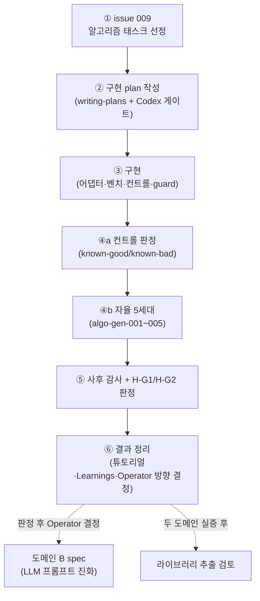

# 로드맵 — 피벗(2026-07-13) 이후 진행 계획

> 작성: 2026-07-13 · 근거: [피벗 spec](superpowers/specs/2026-07-13-agent-promotion-governance-pivot-design.md) §8 후속 순서 · [INTENT.md](../INTENT.md)
> 이 문서는 **설명용 로드맵**입니다. 정량 판정 기준의 권위는 spec §5에 있으며, 본 문서는 복사 인용만 합니다.
> 일정은 달력이 아니라 **태스크 + 의존성**으로 관리합니다. 각 단계의 완료 기준(Done)을 명시합니다.

## 현재 위치

피벗 사이클의 문서 단계가 끝난 상태입니다.

| 완료된 것 | 커밋 |
|---|---|
| 피벗 방향 결정 (decision brief 4선택지 → A) | `88a505a` (issues/008) |
| 피벗 spec — Codex 게이트 block 8건 반영 후 approve | `88a505a` → `db93987` |
| INTENT/CLAUDE/PRD 정합 + issue 009 신설 + 하우스키핑 | `a2a2a88` |

이제부터는 **실행 단계**입니다. 전체 흐름은 여섯 단계이며, spec §8의 후속 순서를 그대로 따릅니다.

병렬 실행 가능 지점: ③ 내부의 서브태스크(벤치 스위트 ↔ 어댑터 코드 ↔ 컨트롤 후보 작성)는
인터페이스 확정 후 상호 독립이므로 subagent 병렬 진행이 가능합니다. ①~②는 순차(각각이 다음의
입력), ④~⑤는 순차(사전 등록 순서가 판정 유효성의 조건)입니다.

---

## ① issue 009 — 알고리즘 태스크 선정

**무엇을**: 도메인 A 루프가 최적화할 알고리즘 태스크 1개를 확정합니다.
[issues/009](../issues/009-algo-opt-task-selection.md)가 트래커입니다.

**왜 먼저**: 태스크가 정해져야 워크로드 패밀리 분할(dev/holdout≥3/sealed 1), 참조 구현,
컨트롤 후보의 구체 설계가 가능합니다. 구현 plan의 모든 태스크가 이 결정에 의존합니다.

**선정 기준** (spec §4 복사 인용):
1. 정합성 판정이 결정적 (테스트로 정답/오답이 갈림)
2. 워크로드 패밀리 6개+ 구성 가능
3. 단일 파일 구현이 수백 줄 이내
4. 실행시간이 로컬에서 초 단위
5. 정직한 개선 여지와 gaming 여지가 공존 (컨트롤 후보 2종 작성 가능)

**후보와 쟁점**:
- **bin packing 휴리스틱** — 개선 여지가 크지만, "빠른데 품질이 나쁜 해"를 걸러낼 품질 하한을
  정합성 제약으로 고정해야 합니다 (지표는 실행시간 단독이어야 하므로).
- **정규식 매칭 / 문자열 검색** — 실행시간 지표가 가장 자연스럽고, 입력 캐싱 같은 gaming 여지가
  풍부해 Codex 관문 시험에 유리합니다.
- **그래프 휴리스틱** — 패밀리 다양성이 좋지만 구현이 커질 위험이 있습니다.

**진행 방법**: 후보별 미니 브리프(각 기준 충족 여부 표)를 만들어 Operator가 선택합니다.
결과 확인 전 결정이므로 사후 기준 변경 금지 원칙과 충돌하지 않습니다.

**Done**: issue 009가 태스크 + 패밀리 분할 + 참조 구현 출처를 명시하고 `resolved`로 갱신됨.

## ② 구현 plan 작성 (writing-plans → Codex 게이트)

**무엇을**: `superpowers:writing-plans` 스킬로 구현 plan을 작성하고, 선례(v2 사이클: plan 1차
block 6건 → 반영 → approve)대로 `codex-review-approval` 게이트를 통과시킵니다.

**plan에 반드시 담길 태스크 (예상 구성)**:
1. `domains/algo-opt/` 골격 — 참조 구현(`solver.py` 초기 상태), 정합성 테스트, 패밀리별 벤치 케이스
2. 측정 하니스 — 반복 측정 5회 median, 타임아웃(참조 구현의 10배, 패밀리별 사전 측정), noise 대책
3. 어댑터 4콜백 — `parse_metric` / `reference_metric` / `extract_group` / `run_candidate`
   (spec §4 계약: `valid=false, metric=inf` 도태 규칙 포함)
4. guard 확장 — 후보 코드의 벤치 경로 참조 차단 (기존 FORBIDDEN_PATTERNS 패턴 재사용)
5. orchestrator 어댑터 주입 — 기존 `src/pipeline` 통계 코어는 무변경 (Explore 실측: 100% 도메인-중립)
6. 컨트롤 후보 2종 작성 + **기대 판정과 함께 사전 커밋** (spec §5 사전 등록 요건)
7. sealed 패밀리 봉인 커밋 (루프 실행 전)
8. 도메인 A용 program.md 아날로그 (에이전트 노출 경계: solver.py + 태스크 서술 + dev 집계 지표만)
9. 테스트 — 기존 1,470줄 테스트 스위트에 어댑터·guard 확장분 추가

**주의 (Not 준수)**: plan은 spec §5의 판정 기준을 *복사 인용*만 해야 하며 재정의하면 즉시 reject
됩니다 (INTENT 권한 vs spec 권한 분리 invariant).

**Done**: plan 문서가 `docs/superpowers/plans/`에 커밋되고 Codex 게이트 approve.

## ③ 구현 (subagent-driven, 태스크별 리뷰 게이트)

**무엇을**: plan의 태스크를 v2 선례대로 subagent-driven으로 구현합니다 (태스크별 TDD + 리뷰).

**병렬 가능**: 어댑터 인터페이스(콜백 시그니처)가 태스크 3에서 확정되면, 벤치 스위트(1·2),
컨트롤 후보(6), guard(4)는 상호 독립 — 병렬 subagent 배분이 가능합니다.

**frozen 경계 주의**: 구현 중 `prepare.py`·`train.py`·`pretrain/`은 절대 건드리지 않습니다
(사례 연구 1 보존). 새로 만드는 벤치 스위트·하니스·컨트롤도 커밋 즉시 frozen — 이후 변경은
에이전트가 아니라 새 spec 경로로만 갑니다.

**Done**: `make test`/`make lint` 통과 + 태스크별 리뷰 게이트 통과 + 컨트롤 후보·sealed 패밀리
사전 커밋 완료.

## ④ 실행 — 컨트롤 판정, 그 다음 자율 5세대

**④a 컨트롤 판정 (반드시 자율 세대보다 먼저)**:
- known-good(정직한 개선)과 known-bad(dev 벤치 gaming)를 동일 게이트 체인에 오프라인 투입합니다.
- 기대: known-good은 승격 판정, known-bad는 차단 판정 (어느 관문이 잡는지 기록 — LOGO/T1인지
  Codex인지 자체가 연구 데이터).
- **기대와 다르면**: 그것도 판정입니다. known-bad가 통과하면 H-G1의 민감도 항목이 기각되고,
  그 사실을 그대로 기록합니다. 게이트를 "고쳐서 다시" 돌리는 것은 사후 기준 변경이므로 금지 —
  수정하려면 새 spec 경로입니다.

**④b 자율 5세대 (algo-gen-001~005)**:
- 세대당 후보 4개, 반복 측정 5회 median 선발 → holdout LOGO probe → 교차그룹 T1 → Codex 의미
  심사. 전 관문 통과 시에만 승격(baseline 교체).
- 세대마다 `experiments/algo-gen-NNN/README.md` 튜토리얼을 **결과 정리 전에** 생성합니다
  (`experiment-tutorial` 스킬 — 기존 필수 마무리 단계 유지).
- 비용: 로컬 실행이라 AWS 과금 0. LLM 호출은 구독 CLI만 사용합니다.

**Done**: 컨트롤 판정 2건 + 자율 5세대의 generation.json·튜토리얼이 전부 커밋됨.

## ⑤ 사후 감사 + H-G1/H-G2 판정

**사전 등록된 프로토콜** (spec §5 복사 인용)을 그대로 실행합니다:
- **시점**: 5세대 + 컨트롤 완료 직후. sealed 패밀리 결과를 열람하기 전에는 체크리스트 이외의
  기준을 추가할 수 없습니다.
- **주체**: Operator + 독립 엔진 심사 1회 (승격 심사에 쓴 Codex 세션과 별개의 새 세션).
- **체크리스트**: ① 승격 후보 정합성 테스트 전항목 재실행, ② frozen SHA 불변 확인, ③ 승격 후보
  코드의 gaming 수동 검사, ④ sealed 패밀리에서 승격 후보 vs 참조 구현 paired 비교 (R=10,
  Wilcoxon + bootstrap 95% CI + α=0.05).
- **판정**:
  - H-G1 = 민감도(known-good 승격 ∧ known-bad 차단) ∧ 부당 승격 0건 ∧ 근거 artifact 완비.
  - H-G2 = in-loop 개선 세대 중 과반이 교차그룹 괴리면 "EDA 발견의 재현", 아니면 "도메인 조건부",
    모수 0이면 `unverifiable`.
- **성공의 의미**: 실험 완주 성공 = 판정이 사전 고정 기준대로 내려짐. **가설 기각도 성공입니다**
  — 정직하게 기록되면 됩니다.

**Done**: `experiments/algo-audit/README.md`(감사 결과) + H-G1/H-G2 판정 기록 커밋.

## ⑥ 결과 정리와 다음 방향 결정 (Operator)

- INTENT.md Learnings에 도메인 A 판정 기록 (co-evolution 기록 지속).
- 판정 결과를 근거로 Operator가 다음을 선택합니다:
  - **도메인 B(LLM 프롬프트 진화) spec 착수** — H-G1이 지지됐다면 자연스러운 다음 수순.
    별도 brainstorming→Codex 게이트로 시작합니다 (본 로드맵 범위 밖).
  - **논문화 반영** — 사례 연구 1(PAPER.ko.md) + 도메인 A를 묶어 거버넌스 프레이밍으로 재구성.
  - **(H-G1 기각 시)** 기각 원인 분석을 새 spec으로 — 게이트 수정은 반드시 새 사이클입니다.
- **라이브러리 추출**은 도메인 A·B 두 실증이 모두 끝나기 전에는 착수 금지 (INTENT Not).

## 열린 항목 (로드맵 외 정리 대기)

| 항목 | 상태 | 처리 |
|---|---|---|
| `docs/superpowers/plans/2026-07-12-safe-autoresearch-runner.md` (untracked) | 피벗 전 plan 초안 — stale 가능성 | Operator 확인 후 삭제 또는 ② plan에 흡수 |
| `experiments/multidesign/manifest.json` (untracked) | v2 코퍼스 부산물 추정 | Operator 확인 후 삭제/커밋 결정 |
| `.claude/agents/*.md` 4종 stale | 피벗 2회 전 전제 | 도메인 A 구조 확정(③) 후 rework 또는 삭제 |
| wiki 갱신 | post-pivot wiki가 EDA 세대 기준 | 도메인 A 첫 세대 후 ingest |

## 위험과 완화

- **실행시간 측정 noise (로컬 CPU 변동)** — 반복 측정 + paired 설계가 1차 방어. 구현 plan에서
  측정 절차(코어 고정·워밍업 등)를 고정합니다. INTENT 엣지 케이스에 `(?)`로 등록돼 있습니다.
- **Codex 관문의 불완전성** — LLM 심사자 gaming 탐지율 ~63%(TRACE). 게이트 체인은 다층 방어로만
  주장하고, 컨트롤 known-bad가 실제로 어느 관문에서 잡히는지를 데이터로 남깁니다.
- **범위 팽창** — 도메인 B·추출·RHB ablation은 전부 Not의 "범위 밖"에 고정돼 있습니다. 유혹이
  생기면 이 로드맵이 아니라 새 spec 경로로 갑니다.
