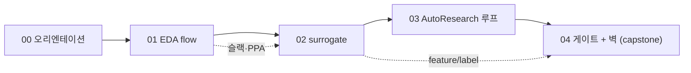
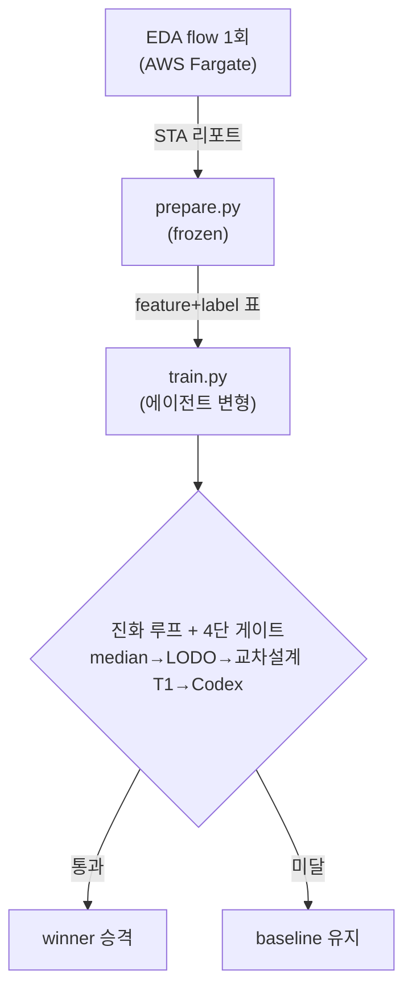
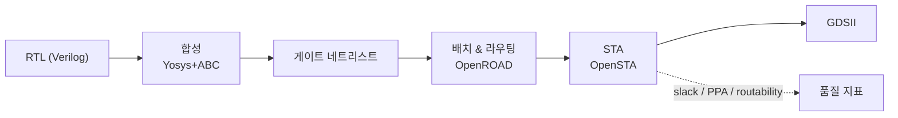
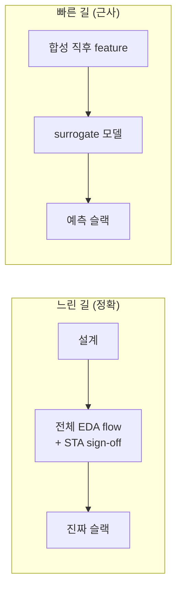
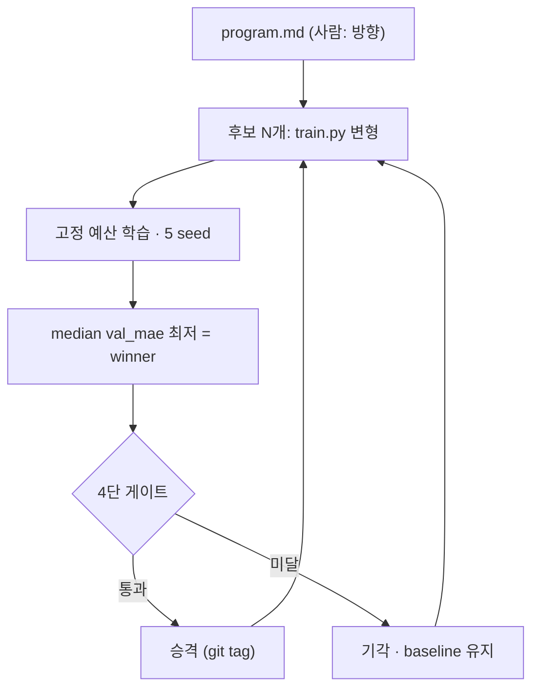
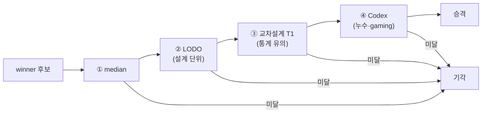

# Tutorial Concept Curriculum Implementation Plan

> **For agentic workers:** REQUIRED SUB-SKILL: Use superpowers:subagent-driven-development (recommended) or superpowers:executing-plans to implement this plan task-by-task. Steps use checkbox (`- [ ]`) syntax for tracking.

**Goal:** ML은 알지만 반도체/EDA는 처음인 개발자가 이 저장소를 이해하도록 `tutorial/` 개념 커리큘럼(README + 5레슨 + 하이브리드 다이어그램)을 만든다.

**Architecture:** 루트 `tutorial/`에 linear 5레슨 마크다운 + `assets/`(draw-diagram SVG). 구조·흐름 도식은 Mermaid(자동 렌더), 직관 은유 3장은 draw-diagram→SVG. 기존 `docs/TUTORIAL.md`·`experiments/README.md`는 복제 않고 링크.

**Tech Stack:** Markdown + Mermaid(코드펜스) + draw-diagram 스킬(.drawio→.svg). 빌드/런타임 없음 — 순수 문서.

## Global Constraints

- 대상: ML 개념(MAE·과적합·교차검증·통계 유의성·일반화) **가정**. 재교육 금지, EDA 두 축(시간 분리·설계 단위)으로 재좌표화만.
- 비목표: `docs/TUTORIAL.md`/`experiments/README.md`/용어 사전 **복제 금지 → 링크**. AWS 인프라 레슨 없음. 전체 재현 실습 없음(포인터+1줄 예시만).
- 정직성: **SNS 모델 언급 금지**(grounded 미검증). 교차설계 벽은 "신규 발견"이 아니라 **ML-for-EDA의 알려진 현상**(우리 기여=자율 재현+게이트 포착)으로 프레이밍.
- 사실 불변: prepare.py frozen·train.py 단일 변형·게이트 정의 등 repo 사실 왜곡 금지. 정량 임계값 재정의 금지(spec 인용만).
- 다이어그램 매체: 구조/흐름=Mermaid, 직관 은유=draw-diagram→SVG(`.drawio`+`.svg` 둘 다 `tutorial/assets/`에 커밋).
- 커밋 prefix `docs:`, subject imperative. main 직접 커밋.
- 모든 레슨 골격: ① 직관 → ② 다이어그램 → ③ "이 repo에선" 파일 포인터 → ④ grounded 더 읽을거리 → ⑤ 이해 점검 2~3문.

### Grounded 출처 (레슨 §4에 인용 — spec §6)

- OpenROAD: https://en.wikipedia.org/wiki/OpenROAD_Project
- OpenROAD-flow-scripts: https://openroad-flow-scripts.readthedocs.io/en/latest/tutorials/FlowTutorial.html
- CircuitNet: https://circuitnet.github.io · CircuitNet 2.0(ICLR24): https://openreview.net/pdf/18243659a4c68baa73e34792453c17d63e6f68a3.pdf
- Xie ML-for-EDA survey(RouteNet/Net2): https://arxiv.org/abs/2206.03032v1
- MasterRTL(ICCAD23): https://arxiv.org/abs/2311.08441
- Circuit as a Set of Points(NeurIPS23): https://proceedings.neurips.cc/paper_files/paper/2023/file/6697bb267dc517379bc8aa326e844f8d-Paper-Conference.pdf
- AutoResearch: https://www.verdent.ai/guides/what-is-autoresearch-karpathy · https://www.snackonai.com/p/autoresearch-the-engineering-behind-karpathy-s-autonomous-ml-experiment-loop
- 교차설계 일반화: https://zhiyaoxie.com/files/chapter_route.pdf · SwiftCTS https://arxiv.org/pdf/2606.11348v1.pdf · NSF robustness https://par.nsf.gov/servlets/purl/10626479 · EDALearn https://arxiv.org/pdf/2312.01674.pdf

---

### Task 1: 스캐폴드 + README 인덱스

**Files:**
- Create: `tutorial/README.md`, `tutorial/assets/.gitkeep`

**Interfaces:**
- Produces: `tutorial/README.md`가 00~04 레슨으로 전방 링크(파일명 계약: `00-orientation.md`·`01-eda-flow.md`·`02-surrogate-models.md`·`03-autoresearch-loop.md`·`04-gates-and-the-wall.md`). 후속 태스크가 이 파일명을 따른다.

- [ ] **Step 1: README 작성** — 포함: (a) 한 문단 대상/목표("ML은 알고 반도체는 처음"), (b) 사용법(00부터 순서대로), (c) 기존 문서와 관계 표(서사=`../docs/TUTORIAL.md`, 세대=`../experiments/README.md`, 게이트=`../wiki/gate-chain.md`), (d) **개념 의존 그래프 Mermaid**:



- [ ] **Step 2: 검증** — Run: `ls tutorial/README.md tutorial/assets/.gitkeep && grep -c '```mermaid' tutorial/README.md`
  Expected: 두 파일 존재 + mermaid 펜스 ≥1.

- [ ] **Step 3: 커밋** — `git add tutorial/ && git commit -m "docs(tutorial): scaffold tutorial/ + README 인덱스·개념 의존맵"`

---

### Task 2: 00-orientation.md (큰 그림)

**Files:**
- Create: `tutorial/00-orientation.md`

**Interfaces:**
- Consumes: README 파일명 계약.
- Produces: 독자 포지셔닝 2축("feature/label 시간 분리", "fold=설계 단위")을 명명 — 02·04가 이 표현을 재사용.

- [ ] **Step 1: 작성** — 섹션: (1) 이 repo가 한 일 한 장 요약 + **큰그림 Mermaid**(EDA flow 1회 → `prepare.py`(고정) → `train.py`(변형) → 진화루프+게이트). (2) 독자 포지셔닝: "당신은 ML은 안다 — 새로운 건 ① feature(합성직후)와 label(최종)의 *시간 분리*, ② fold가 무작위 split이 아니라 *설계 단위*(LODO)". (3) 커리큘럼 사용법 + 서사/세대 문서 링크. repo 포인터: `../README.md`, `../INTENT.md`.



- [ ] **Step 2: 검증** — `grep -q '시간 분리' tutorial/00-orientation.md && grep -q '설계 단위' tutorial/00-orientation.md && grep -c '```mermaid' tutorial/00-orientation.md` → 두 축 명명 + mermaid ≥1. 링크 검증: `for f in README.md INTENT.md docs/TUTORIAL.md experiments/README.md; do test -e "$f" || echo "MISSING $f"; done` → 출력 없음.

- [ ] **Step 3: 커밋** — `git add tutorial/00-orientation.md && git commit -m "docs(tutorial): 00 오리엔테이션 — 큰 그림 + 독자 2축 포지셔닝"`

---

### Task 3: 01-eda-flow.md (반도체 EDA 기초 + slack-margin.svg)

**Files:**
- Create: `tutorial/01-eda-flow.md`, `tutorial/assets/slack-margin.drawio`, `tutorial/assets/slack-margin.svg`

**Interfaces:**
- Produces: 타이밍 슬랙 정의(양수=통과 마진) — 02·04가 label로 재사용.

- [ ] **Step 1: slack-margin 일러스트 제작** — draw-diagram 스킬로 `slack-margin.drawio` 작성: 클럭 주기 막대 위에 "required time"과 "arrival time"을 표시, 둘 사이 간격=**slack(여유 마진)**, 양수=통과/음수=위반. SVG export → `assets/slack-margin.svg`. (export 도구 부재 시: 동일 내용을 손으로 작성한 inline SVG를 `.svg`로 저장하고 `.drawio`는 같은 구조의 XML로 남긴다.)

- [ ] **Step 2: 레슨 작성** — 섹션: (1) RTL→GDSII 흐름: 합성(Yosys+ABC)→배치·라우팅(OpenROAD)→STA(OpenSTA), **파이프라인 Mermaid**. (2) 핵심 숫자: 타이밍 슬랙(+``), PPA, routability/DRC. (3) "이 repo에선": `../docker/`(eda-flow), `../cdk/`, `../experiments/real-gcd-fargate/`(실제 synth.rpt/route.rpt). (4) 더 읽을거리: OpenROAD·OpenROAD-flow-scripts URL. (5) 이해 점검 2문(예: "슬랙이 음수면?", "PPA의 세 글자?").



- [ ] **Step 3: 검증** — `ls tutorial/assets/slack-margin.svg && grep -q 'assets/slack-margin.svg' tutorial/01-eda-flow.md && grep -c '```mermaid' tutorial/01-eda-flow.md` (≥1). repo 포인터 존재: `for p in docker cdk experiments/real-gcd-fargate; do test -e "$p" || echo "MISSING $p"; done` → 출력 없음. 정직성: `grep -qi 'SNS' tutorial/01-eda-flow.md && echo "VIOLATION SNS"` → 출력 없어야 함.

- [ ] **Step 4: 커밋** — `git add tutorial/01-eda-flow.md tutorial/assets/slack-margin.* && git commit -m "docs(tutorial): 01 EDA flow — RTL→GDSII·슬랙·PPA + slack-margin 일러스트"`

---

### Task 4: 02-surrogate-models.md (surrogate + feature-label-timeline.svg)

**Files:**
- Create: `tutorial/02-surrogate-models.md`, `tutorial/assets/feature-label-timeline.drawio`, `tutorial/assets/feature-label-timeline.svg`

**Interfaces:**
- Consumes: 01의 슬랙 정의. Produces: "feature=합성직후 / label=최종" 시간축 — 04 capstone이 참조.

- [ ] **Step 1: feature-label-timeline 일러스트** — draw-diagram으로 EDA 흐름 가로 시간축: **feature 캡처 지점=합성 직후**, **label 측정 지점=최종 라우팅 후**, 그 사이 간극을 surrogate가 예측한다는 화살표. SVG export → `assets/feature-label-timeline.svg`. (export 부재 시 inline SVG fallback.)

- [ ] **Step 2: 레슨 작성** — 섹션: (1) 왜 시뮬 대신 예측(느린 sign-off→빠른 근사), **느린sim vs 빠른예측 Mermaid**. (2) feature(합성직후)→label(최종 슬랙) 매핑 + ``. (3) ML-for-EDA landscape: CircuitNet/2.0·RouteNet·Net2·MasterRTL 각 1줄(무엇을 무엇으로부터 예측). **SNS 금지.** (4) "이 repo에선": `../prepare.py`(frozen), `../docs/TRAIN.md`, `../data/`. (5) 더 읽을거리: CircuitNet·Xie survey·MasterRTL·Circuit-as-Points URL. (6) 이해 점검 2문.



- [ ] **Step 3: 검증** — `ls tutorial/assets/feature-label-timeline.svg && grep -q 'assets/feature-label-timeline.svg' tutorial/02-surrogate-models.md`. SNS 금지: `grep -qi '\bSNS\b' tutorial/02-surrogate-models.md && echo "VIOLATION SNS"` → 무출력. repo 포인터: `for p in prepare.py docs/TRAIN.md data; do test -e "$p" || echo "MISSING $p"; done` → 무출력.

- [ ] **Step 4: 커밋** — `git add tutorial/02-surrogate-models.md tutorial/assets/feature-label-timeline.* && git commit -m "docs(tutorial): 02 surrogate — 시간 분리 feature/label + ML-for-EDA landscape"`

---

### Task 5: 03-autoresearch-loop.md (AutoResearch 루프)

**Files:**
- Create: `tutorial/03-autoresearch-loop.md`

**Interfaces:**
- Produces: "이 repo가 바꾼 점"(population+게이트+교차설계) — 04가 이어받음.

- [ ] **Step 1: 작성** — 섹션: (1) Karpathy AutoResearch: 연구=검색, 단일 `train.py` 변형, 고정 예산, git ratchet(개선=keep/아니면 revert). (2) 이 repo가 바꾼 점 대비표: 단일 lineage→population, 단일 지표→median 선택, 무게이트→**4단 객관 게이트**, in-distribution→교차설계 축. (3) 정직성: 원본은 *no human in loop*("human asleep"); 이 repo는 *비전문가가 방향만*(per-winner 승인 아님). (4) **진화 루프 Mermaid**. (5) "이 repo에선": `../program.md`·`../train.py`·`../src/pipeline/`·`../config.yaml`. (6) 더 읽을거리: AutoResearch 2개 URL. (7) 이해 점검 2문.



- [ ] **Step 2: 검증** — `grep -q 'ratchet\|개선' tutorial/03-autoresearch-loop.md && grep -q 'human asleep\|방향만\|per-winner' tutorial/03-autoresearch-loop.md && grep -c '```mermaid' tutorial/03-autoresearch-loop.md` (≥1). repo 포인터: `for p in program.md train.py src/pipeline config.yaml; do test -e "$p" || echo "MISSING $p"; done` → 무출력.

- [ ] **Step 3: 커밋** — `git add tutorial/03-autoresearch-loop.md && git commit -m "docs(tutorial): 03 AutoResearch 루프 — 연구=검색 + 이 repo가 바꾼 점"`

---

### Task 6: 04-gates-and-the-wall.md (capstone + the-wall.svg)

**Files:**
- Create: `tutorial/04-gates-and-the-wall.md`, `tutorial/assets/the-wall.drawio`, `tutorial/assets/the-wall.svg`

**Interfaces:**
- Consumes: 02 feature/label, 03 게이트. 커리큘럼 종착 — `../experiments/README.md`로 전방 링크.

- [ ] **Step 1: the-wall 일러스트** — draw-diagram으로 2선 그래프: x=세대(gen-004~008), 선A=in-loop median val_mae 하강(예 3.7→1.29→0.53), 선B=교차설계 T1 평탄(`indistinguishable`). 캡션 "in-loop↓ ≠ 교차설계 우위". SVG export → `assets/the-wall.svg`. (export 부재 시 inline SVG fallback.)

- [ ] **Step 2: 레슨 작성** — 섹션: (1) 4단 권력분립: median→LODO→교차설계 T1→Codex, 생성자≠판정자, 한 단계라도 막히면 baseline 유지. **게이트 체인 Mermaid**. (2) 교차설계 벽 + ``: in-loop val_mae 최저 경신인데 교차설계는 평탄. (3) **정직성 프레이밍(핵심)**: 이 벽은 ML-for-EDA의 *알려진 현상*(SwiftCTS·EDALearn·NSF robustness — 1% 셀 이동에 예측 90% 출렁). repo 기여=① 자율 루프가 스스로 재현 ② 게이트가 5건 위양성 차단(gen-002~008). (4) "이 repo에선": `../wiki/gate-chain.md`·`../experiments/gen-004`~`gen-008`·`../INTENT.md` Learnings. (5) 더 읽을거리: 교차설계 4개 URL. (6) 이해 점검 2문. (7) "다음" — `../experiments/README.md` 세대 해설로 링크.



- [ ] **Step 3: 검증** — `ls tutorial/assets/the-wall.svg && grep -q 'assets/the-wall.svg' tutorial/04-gates-and-the-wall.md`. 정직성: `grep -qi '알려진\|known\|SwiftCTS\|robustness' tutorial/04-gates-and-the-wall.md || echo "MISSING 정직성 프레이밍"` → 무출력. repo 포인터: `for p in wiki/gate-chain.md experiments/gen-004 experiments/gen-008 experiments/README.md; do test -e "$p" || echo "MISSING $p"; done` → 무출력.

- [ ] **Step 4: 커밋** — `git add tutorial/04-gates-and-the-wall.md tutorial/assets/the-wall.* && git commit -m "docs(tutorial): 04 capstone — 4단 게이트 + 교차설계 벽(알려진 현상·게이트가 포착)"`

---

### Task 7: 교차링크 + 최종 검증 패스

**Files:**
- Modify: `tutorial/README.md`(레슨 간 next/prev 링크 보강), `README.md`(루트, 문서 지도에 `tutorial/` 한 줄 추가)

- [ ] **Step 1: 레슨 간 next/prev 링크** — 00~04 각 하단에 `← 이전 / 다음 →` 링크 추가. README에 5레슨 전부 링크 확인.

- [ ] **Step 2: 루트 README 문서 지도에 tutorial/ 등록** — `../README.md` 문서 지도 표에 "`tutorial/` — ML 개발자용 개념 커리큘럼(반도체 처음)" 행 1줄 추가.

- [ ] **Step 3: 전체 링크/정직성 검증** — Run:
```bash
# 모든 레슨 존재
ls tutorial/README.md tutorial/0{0,1,2,3,4}-*.md
# 모든 svg 인라인 참조가 실제 파일과 매칭
grep -rho 'assets/[a-z-]*\.svg' tutorial/*.md | sort -u | while read s; do test -e "tutorial/$s" || echo "MISSING $s"; done
# SNS 전역 금지
grep -rni '\bSNS\b' tutorial/ && echo "VIOLATION SNS" || echo "OK no-SNS"
# mermaid 펜스 총수(≥6)
grep -rc '```mermaid' tutorial/*.md | awk -F: '{s+=$2} END{print "mermaid total:", s}'
```
  Expected: MISSING 출력 없음, "OK no-SNS", mermaid total ≥6.

- [ ] **Step 4: INTENT 정합 점검(육안)** — prepare.py frozen·게이트 정의·정량 임계값 재정의 없음 확인. 교차설계 벽=알려진 현상 프레이밍 유지.

- [ ] **Step 5: 커밋** — `git add tutorial/ README.md && git commit -m "docs(tutorial): 레슨 교차링크 + 루트 문서 지도 등록 + 최종 검증"`

---

## Self-Review (작성자 체크)

- **Spec coverage**: spec §3 구조(README+5레슨+assets)=Task1~7 ✓; §4 매체 규칙(Mermaid 6 + SVG 3)=Task2~6 ✓; §5 레슨별 명세=Task2~6 1:1 ✓; §6 출처=Global Constraints에 URL ✓; §7 기존 문서 링크=Task1·6·7 ✓; §8 검증=각 Task 검증 step + Task7 ✓; §9 INTENT 정합=Task7 Step4 ✓.
- **Placeholder scan**: 각 Mermaid·검증 명령 실제 내용 포함, "TBD" 없음. SVG는 draw-diagram + export 부재 시 inline SVG fallback 명시(블로커 제거).
- **Type consistency**: 파일명 계약(`00-orientation.md`…`04-gates-and-the-wall.md`)·SVG명(`slack-margin`·`feature-label-timeline`·`the-wall`)이 Task 간 일치 ✓.
