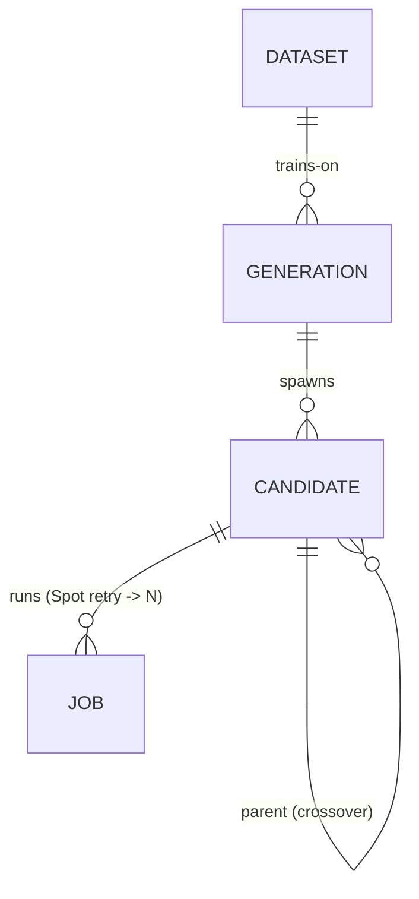

# 피벗 설계 — AutoResearch 기반 EDA Surrogate 모델 자동 연구

> status: draft (brainstorming 산출, Operator 검토 대기)
> created: 2026-05-29
> supersedes-candidate: [`2026-04-19-integrated-research-program-design.md`](2026-04-19-integrated-research-program-design.md) (현 overview spec — 본 피벗 승인 시 archived 전환 후보)
> 외부 구조 참조: [karpathy/autoresearch](https://github.com/karpathy/autoresearch) · [roboco-io/serverless-autoresearch](https://github.com/roboco-io/serverless-autoresearch)

## 1. 피벗 배경 (Why pivot)

현 통합 프로그램(L1 Process + L2 Substrate + L3 Content, 3-layer × 5축 process novelty)은 **Operator 1명이 6개월에 끝내기엔 범위가 과도**하다는 판단(2026-05-29 brainstorming, 동기 = "범위가 너무 큼"). 전체 RTL→GDSII 공정을 에이전트로 운영하는 대신, **하나의 EDA 서브태스크에 AutoResearch 자동 연구 루프를 적용**하는 쪽으로 대상을 축소한다.

## 2. 확정된 피벗 결정 (brainstorming 5문항)

| 결정 항목 | 선택 |
|---|---|
| 피벗 동기 | 범위가 너무 큼 → 대상 축소 |
| 방향 | A+B 하이브리드 — 하나의 EDA 도구 위에서 AutoResearch 루프가 자동 개선 |
| 최적화 대상 | **ML 모델 (진짜 학습)** — train.py/val_bpb 아날로그 |
| EDA 서브태스크 | **Surrogate 지표 예측** (합성 직후 feature → 최종 PPA/routability 예측) |
| publish 축 | 프로세스 novelty 유지 (단, 1차 ERD에서는 증거 평면 *연기*) |
| 루프 인프라 | 기존 L1/L2/L3 인프라 폐기, **serverless-autoresearch 구조 채택** |
| ERD 범위 | 순수 실험추적 **최소 4-엔티티** (증거 평면은 2차 세대로 연기) |

## 3. 핵심 개념 (한 줄)

> karpathy AutoResearch의 population-based evolution 루프(serverless-autoresearch HUGI 패턴)를, EDA surrogate 지표예측 모델 학습에 적용한다. 에이전트는 학습 스크립트 한 파일만 변형하고, 고정 예산으로 학습 후 단일 val 지표로 keep/discard하며, Operator가 세대 winner 선택을 감독한다.

## 4. 구조 치환 매핑

| serverless-autoresearch | 피벗된 프로젝트 |
|---|---|
| `train.py` (에이전트 변형, 단일 파일) | surrogate 모델 학습 스크립트 (에이전트 변형) |
| `prepare.py` (read-only, 데이터·평가) | EDA 데이터셋 준비 — flow 1회 실행으로 feature(합성 직후) + label(최종 PPA) 추출 |
| `program.md` (baseline 지시문) | EDA surrogate baseline 지시문 |
| `config.yaml` (AWS/파이프라인) | 동일 — region/Spot/세대수/population 크기 |
| `val_bpb` 최소화 | surrogate val 지표 (예: slack/area 예측 MAE↓ 또는 R²↑) |
| `gen-NNN-best` git tag | 세대 winner + reversible patch |
| population evolution (N=10 후보/세대, HUGI 병렬) | 동일 — 후보 변형 전략 conservative/moderate/aggressive/crossover |
| (없음) | **[연기] REASONING_TRACE · DECISION · FINDING** = 유지하기로 한 process novelty, 2차 세대 |

## 5. 루프 (4-step generation cycle, serverless-autoresearch 계승)

1. **Candidate Generation** — 현 baseline 학습 스크립트에서 N개 변형 후보 생성 (전략 다양화)
2. **Batch Launch** — 후보를 병렬 SageMaker Spot 학습 job으로 제출 (HUGI)
3. **Result Collection** — job 폴링, CloudWatch에서 val 지표 추출
4. **Selection** — 최저 val 지표 winner 식별 → **Operator 승인 후** git tag로 commit, 세대 카운터 증가

제약 (원본 계승): 학습 스크립트 단일 파일만 변형 · 고정 학습 예산 · 신규 의존성 금지 · 단일 지표 최소화.

## 6. ERD (최소 4-엔티티)

| 엔티티 | 핵심 속성 | 역할 |
|---|---|---|
| **DATASET** | id, source_design, feature_set, label_metric, s3_uri, **flow_lockfile_sha** | flow 1회로 생성된 고정 라벨셋. `flow_lockfile_sha`가 재현성 앵커 |
| **GENERATION** | id, gen_no, baseline_ref, status, winner_candidate_id | 진화 1세대 |
| **CANDIDATE** | id, gen_id(FK), strategy(conservative/moderate/aggressive/crossover), **patch_ref**, parent_id(FK self), is_winner, artifact_uri, git_tag | 변형된 학습 스크립트 1개 = reversible patch. winner artifact 속성 흡수 |
| **JOB** | id, candidate_id(FK), spot_status, **val_metric**, train_time, cost, log_uri | Spot 실행 1회 (회수 시 candidate당 1:N). RESULT 흡수 |

축소 근거: RESULT는 JOB 속성으로, MODEL_ARTIFACT는 CANDIDATE 속성으로 흡수해 6→4 엔티티. CANDIDATE self-reference(parent_id)가 진화 계보를 담아, 연기한 reasoning trace를 나중에 붙일 hook이 된다.

## 7. 연기 항목 (2차 세대, 폐기 아님)

publish 축인 process novelty 증거 평면은 1차 ERD에서 제외하되 폐기하지 않는다:
- **REASONING_TRACE** (candidate별 hypothesis/expected·observed effect/judge_score κ) — H3 증거
- **DECISION** (Operator keep/discard/reframe + rationale) — Operator 권한
- **FINDING** (누적 재사용 통찰 + confidence tier) — H1a 재사용

CANDIDATE.parent_id 계보가 이 3 엔티티의 부착점이다.

## 8. 결정 보류 (issues/ 후보 — 본 spec에 인라인 금지)

- 정확한 surrogate 지표 정의 (slack vs area vs routability, 단일 vs 복합)
- feature_set 구성 (합성 리포트 어느 필드까지)
- 데이터 규모 / flow 1회 실행으로 충분한 라벨 수 확보 가능 여부
- 모델 클래스 (tabular regression vs GNN — CPU 학습 가능성)
- INTENT.md 재작성 범위 (Why/What/Not 델타) 및 overview spec archived 전환 여부

## 9. INTENT.md 영향 (재작성 후보, 본 spec은 선언만)

본 피벗 승인 시 INTENT.md의 다음 항목이 재협상 대상이다 — 실제 재작성은 `workflow:intent` 스킬로 별도 진행:
- **What**: L1/L2/L3 3-layer → AutoResearch 단일 루프 + 연기된 증거 평면
- **Not "Parameter sweep 단독 금지"**: surrogate 모델 학습은 sweep이 아니나 경계 재확인 필요
- **Not "전체 공정"**: 단일 서브태스크로 축소 명시
- **유지**: Operator 감독(머지 항상 사람) · reasoning trace(연기) · 오픈소스만 · reversible patch
