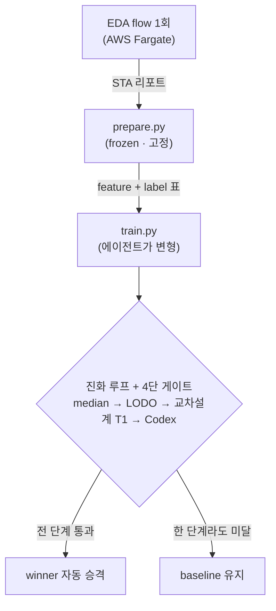

# 00 — 오리엔테이션: 큰 그림과 당신이 새로 배울 2가지

## 이 저장소가 한 일, 한 장으로

이 프로젝트는 **AI 에이전트가 반도체 타이밍 예측 모델을 스스로 연구하게** 만듭니다. 칩이 충분히
빠른지 확인하려면 느린 시뮬레이션(sign-off)을 끝까지 돌려야 하는데, 그 결과를 빠르게 *예측*하는
**대리(surrogate) 모델**을 AI가 반복 개선합니다. 채택 여부는 **객관적 자동 게이트**가 판정하고,
사람은 *방향*과 *큰 흐름*만 봅니다.

각 조각은 01~04 레슨에서 하나씩 풉니다. 지금은 *지형*만 익히세요.

## 당신은 ML을 안다 — 새로운 건 이 2가지 축

이 커리큘럼은 ML 개념(MAE·과적합·train/val split·교차검증·통계 유의성·일반화)을 *다시 가르치지
않습니다*. 당신이 이미 아는 그 개념들이, 반도체 맥락에서 **두 개의 낯선 축**으로 재좌표화될 뿐입니다.

### 축 ① — feature와 label의 *시간 분리*

보통 ML에서 feature와 label은 같은 시점의 한 행입니다. 여기서는 다릅니다. **feature는 설계 흐름의
*합성 직후*에 측정**되고, **label은 그보다 한참 뒤 *최종 라우팅 후*에 측정**됩니다. surrogate는
"이른 시점 정보로 늦은 시점 결과를 예측"하는 모델입니다. (→ [02](02-surrogate-models.md)에서 그림으로)

### 축 ② — fold가 무작위 split이 아니라 *설계 단위*

교차검증의 fold를 무작위로 나누면 같은 칩 설계의 데이터가 train과 val에 섞여 점수가 낙관적으로
나옵니다. 진짜 질문은 "**처음 보는 설계**에도 되나"이고, 그래서 fold를 **설계 단위로** 나눕니다
(한 설계를 통째로 빼는 LODO, Leave-One-Design-Out). 이 차이가 이 프로젝트의 핵심 발견으로
이어집니다. (→ [04](04-gates-and-the-wall.md))

## 이 repo에선

- 전체 개요: [`../README.md`](../README.md)
- 프로젝트의 Why/What/Not/Learnings: [`../INTENT.md`](../INTENT.md)
- 프로젝트 서사 + 용어 사전: [`../docs/TUTORIAL.md`](../docs/TUTORIAL.md)

## 이해 점검

1. 이 시스템에서 feature와 label은 *언제* 각각 측정되나? 둘은 왜 같은 시점이 아닌가?
2. fold를 무작위가 아니라 "설계 단위"로 나누는 이유는?

---

다음 → [01 — 반도체 EDA flow](01-eda-flow.md)
