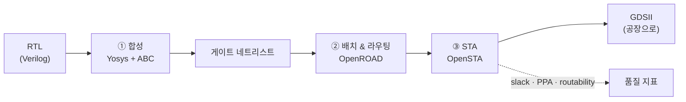
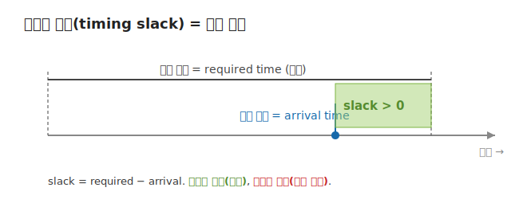

# 01 — 반도체 EDA flow: RTL부터 칩 레이아웃까지

> **EDA**(Electronic Design Automation) = 칩 설계를 자동화하는 소프트웨어 도구들. 이 프로젝트는
> 상용 도구가 아니라 **오픈소스**(OpenROAD·Yosys)만 씁니다.

## RTL→GDSII 흐름

칩 설계는 사람이 쓴 **RTL**(Verilog 같은 하드웨어 기술 언어, "무엇을 계산하나")에서 출발해,
공장에 넘길 **GDSII**(실제 트랜지스터·배선의 기하학적 레이아웃)까지 단계적으로 변환됩니다. 이
전체 변환을 **RTL-to-GDSII flow**라 부릅니다.

- **① 합성(logic synthesis)** — RTL + 표준 셀 라이브러리(`.lib`)를 받아 **게이트 단위 네트리스트**로
  바꿉니다. 오픈소스로는 **Yosys**(+ 기술 매핑 ABC)를 씁니다. OpenROAD 자체엔 합성기가 없어 보통
  Yosys와 함께 씁니다.
- **② 배치 & 라우팅(placement & routing, P&R)** — 게이트(표준 셀)를 칩 위에 *배치*하고(총 배선
  길이·혼잡도 최소화), 그 사이를 실제 금속 배선으로 *연결*합니다. global routing(거친 격자에서 경로
  추정) → detailed routing(정확한 트랙·비아) 순서입니다.
- **③ STA(Static Timing Analysis)** — 네트리스트·기생 성분(SPEF)·제약(SDC)을 읽어 신호의 도착
  시간과 **슬랙**을 계산합니다. 오픈소스 **OpenSTA**가 상용 PrimeTime을 대체합니다.

## 우리가 집착하는 한 숫자: 타이밍 슬랙

칩이 "충분히 빠른가"는 결국 **타이밍 슬랙(timing slack)** 한 숫자로 요약됩니다. 슬랙은 신호가
마감(클럭 주기) 대비 얼마나 여유 있게 도착했는지의 마진입니다.

`slack = required − arrival`. **양수면 통과(여유), 음수면 위반(마감 초과)**. 이 프로젝트의 surrogate
모델이 예측하려는 label이 바로 이 슬랙입니다.

곁들여 두 지표가 더 있습니다:
- **PPA** = **P**ower / **P**erformance / **A**rea(전력·성능·면적) — 칩 품질의 3대 축.
- **routability** — 얼마나 쉽게 배선이 깔리나(혼잡도 + DRC/DRV 위반 핫스팟). 배치가 좋아야
  routability·PPA가 좋아집니다.

## 이 repo에선

- EDA flow 컨테이너·인프라: [`../docker/`](../docker/), [`../cdk/`](../cdk/)
- 실제로 돌린 결과(진짜 STA 리포트): [`../experiments/real-gcd-fargate/`](../experiments/real-gcd-fargate/)
  의 `synth.rpt`(합성 직후) / `route.rpt`(최종 라우팅 후) — 02 레슨의 feature/label이 여기서 나옵니다.

## 더 읽을거리

- OpenROAD Project (RTL→GDSII 전체 흐름): https://en.wikipedia.org/wiki/OpenROAD_Project
- OpenROAD-flow-scripts 튜토리얼: https://openroad-flow-scripts.readthedocs.io/en/latest/tutorials/FlowTutorial.html

## 이해 점검

1. 슬랙이 음수라는 건 칩에 무슨 일이 일어났다는 뜻인가?
2. PPA는 무엇의 약자 세 가지인가?
3. 합성과 배치&라우팅 중, 더 *이른* 단계는 어느 쪽인가? (힌트: 02의 feature가 어디서 나오는지)

---

← [00 오리엔테이션](00-orientation.md) · 다음 → [02 Surrogate 모델](02-surrogate-models.md)
