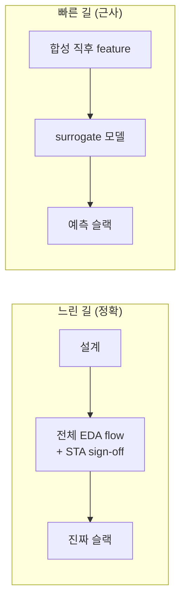
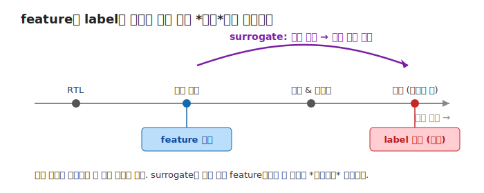

# 02 — Surrogate 모델: 느린 시뮬레이션을 빠른 예측으로

## 왜 예측인가

01에서 본 EDA flow는 정확하지만 **느립니다**. 한 설계의 진짜 타이밍 슬랙을 알려면 합성→배치→
라우팅→STA를 끝까지(sign-off) 돌려야 합니다. 설계를 조금만 바꿔도 이 긴 과정을 다시 돌려야 하죠.

**대리(surrogate) 모델**은 이 느린 과정을 *근사 예측*으로 대체합니다 — 흐름의 이른 단계 정보만으로
최종 결과를 빠르게 추정합니다. 정확도를 조금 내주는 대신 속도를 몇 자릿수 얻습니다.

## 핵심: feature와 label의 시간 분리

[00의 축 ①](00-orientation.md)을 그림으로 봅시다. **feature는 합성 직후**(이른 시점)에 측정하고,
**label은 최종 라우팅 후**(늦은 시점)에 측정합니다. surrogate는 그 *시간 간극*을 건너뛰어 예측하는
모델입니다.

이게 보통의 ML 테이블과 다른 점입니다 — 한 행의 feature와 label이 *같은 순간*이 아니라, 같은 설계의
*다른 시점* 측정값이라는 것. 그래서 "예측이 쉬운가"는 곧 "이른 시점 정보가 늦은 결과를 얼마나
결정하는가"의 문제가 됩니다.

## ML-for-EDA 풍경 (이 분야는 성숙해 있다)

이른 단계 feature로 최종 품질을 예측하는 연구는 이미 여럿 있습니다. 이 프로젝트의 *새로움*은 모델
자체가 아니라 [03의 자율 연구 루프](03-autoresearch-loop.md)에 있습니다.

| 모델 | 무엇을 ← 무엇으로 예측 |
|---|---|
| **RouteNet** (ICCAD'18) | 배선 가능성(routability)·DRC 핫스팟 ← 배치 단계 feature(CNN) |
| **Net2** (ASP-DAC'21) | net 배선 길이(HPWL) ← 배치 전/후 그래프(GAT) |
| **MasterRTL** (ICCAD'23) | 합성 *이전* PPA(타이밍·전력·면적) ← RTL을 비트수준 연산 그래프로 |
| **CircuitNet / 2.0** (ICLR'24) | routability·IR-drop·timing 예측용 *공개 데이터셋*(20K+ 샘플) |
| **Circuit as a Set of Points** (NeurIPS'23) | 혼잡도·DRC 위반 ← 배치를 점 구름(point cloud)으로, Transformer |

(이 프로젝트의 surrogate는 표 형식 트리 모델을 씁니다 — 왜 GNN이 아닌지는
[`../docs/TUTORIAL.md`](../docs/TUTORIAL.md)의 부록 참조.)

## 이 repo에선

- 데이터 준비(feature+label 표 생성, **고정/frozen**): [`../prepare.py`](../prepare.py)
- 학습 스크립트 레퍼런스: [`../docs/TRAIN.md`](../docs/TRAIN.md)
- 데이터 참조: [`../data/`](../data/)

> `prepare.py`는 **에이전트가 건드릴 수 없는 고정 substrate**입니다 — 모든 후보가 같은 데이터·같은
> 평가 규칙으로 공정하게 비교되도록. 에이전트가 변형하는 건 `train.py` 하나뿐(→ [03](03-autoresearch-loop.md)).

## 더 읽을거리

- CircuitNet 데이터셋: https://circuitnet.github.io · CircuitNet 2.0(ICLR'24): https://openreview.net/pdf/18243659a4c68baa73e34792453c17d63e6f68a3.pdf
- Xie, ML-for-EDA 서베이(RouteNet·Net2): https://arxiv.org/abs/2206.03032v1
- MasterRTL(ICCAD'23): https://arxiv.org/abs/2311.08441
- Circuit as a Set of Points(NeurIPS'23): https://proceedings.neurips.cc/paper_files/paper/2023/file/6697bb267dc517379bc8aa326e844f8d-Paper-Conference.pdf

## 이해 점검

1. surrogate가 빠른 이유는? 무엇을 *건너뛰나*?
2. 이 프로젝트에서 feature와 label은 각각 흐름의 어느 시점 측정값인가?
3. `prepare.py`를 에이전트가 못 바꾸게 고정한 이유는?

---

← [01 EDA flow](01-eda-flow.md) · 다음 → [03 AutoResearch 루프](03-autoresearch-loop.md)
