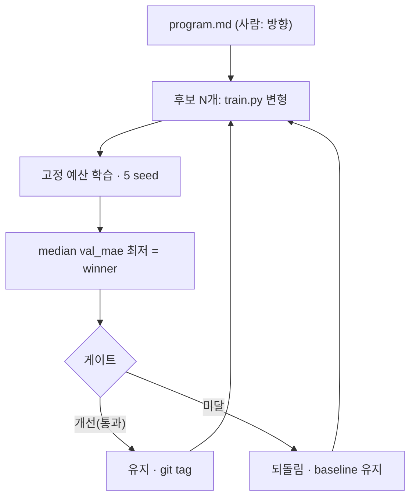

# 03 — AutoResearch 루프: 연구를 검색으로 바꾸기

## Karpathy의 AutoResearch

[AutoResearch](https://github.com/karpathy/autoresearch)는 Andrej Karpathy가 공개한 *자율 ML 연구
루프*입니다. 발상은 단순합니다 — **"연구를 검색(search)으로 환원"**하기. 코딩 에이전트가:

1. 단일 학습 스크립트(`train.py`) 한 파일만 변형하고,
2. **고정된 예산**으로 학습한 뒤(원본은 5분),
3. 단일 지표 하나(원본은 `val_bpb`, 낮을수록 좋음)로 평가하고,
4. 개선됐으면 **유지**(commit), 아니면 **되돌립니다**(`git reset`) — 한 방향 *래칫(ratchet)*.

사람은 코드를 짜는 대신 `program.md`에 **연구 방향**을 적고 "자러 갑니다"("human asleep" — 무인
자율이 원래 전제). AutoML/NAS와 달리 *미리 정한 탐색공간*이 아니라 LLM이 **임의의 코드 변경**을
제안하는 — *코드 공간*에서의 개방 탐색입니다.

## 이 프로젝트가 바꾼 점

이 repo는 AutoResearch를 **EDA surrogate 학습**에 처음 적용하면서, 신뢰가능성을 위해 네 가지를
바꿨습니다:

| 축 | Karpathy 원본 | 이 프로젝트 |
|---|---|---|
| 대상 | LLM 학습(nanochat) | **EDA surrogate**(타이밍 슬랙 예측) |
| 개체군 | 단일 lineage(언덕 오르기) | **population**(세대당 N후보) |
| 선택 | 단일 지표 | **5 seed median**(노이즈 방지, → [04](04-gates-and-the-wall.md)) |
| 승격 판정 | 개선이면 commit | **4단 객관 게이트**(median→LODO→교차설계 T1→Codex) |
| 일반화 축 | in-distribution | **교차설계**(처음 보는 설계, [00 축 ②](00-orientation.md)) |

## 정직한 차이: "human asleep" vs "방향만 잡는 비전문가"

원본 AutoResearch의 전제는 *no human in the loop*("사람은 자고 있다, 너는 자율이다")입니다. 이
프로젝트도 자율 진행을 기본으로 채택하되, 차별점은 **비전문가가 per-winner 승인 없이 *방향과 큰
흐름*만으로 자율 루프를 이해·조종**한다는 데 있습니다. 그래서 무인 자율을 *신뢰가능*하게 만드는
객관적 게이트가 핵심이 됩니다(→ [04](04-gates-and-the-wall.md)).

## 이 repo에선

- 에이전트 방향 지시문: [`../program.md`](../program.md)
- 에이전트가 변형하는 단일 파일: [`../train.py`](../train.py)
- 진화 루프 구현: [`../src/pipeline/`](../src/pipeline/)
- 예산·세대수 설정: [`../config.yaml`](../config.yaml)

## 더 읽을거리

- AutoResearch 해설: https://www.verdent.ai/guides/what-is-autoresearch-karpathy
- AutoResearch 엔지니어링 심층: https://www.snackonai.com/p/autoresearch-the-engineering-behind-karpathy-s-autonomous-ml-experiment-loop

## 이해 점검

1. AutoResearch의 "래칫(ratchet)"은 무엇을 keep하고 무엇을 revert하나?
2. 이 프로젝트가 단일 lineage 대신 population + median을 쓴 이유는?
3. 원본의 "human asleep"과 이 프로젝트의 "방향만 잡는 비전문가"는 무엇이 다른가?

---

← [02 Surrogate 모델](02-surrogate-models.md) · 다음 → [04 게이트와 벽 (capstone)](04-gates-and-the-wall.md)
