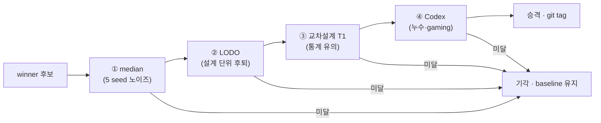
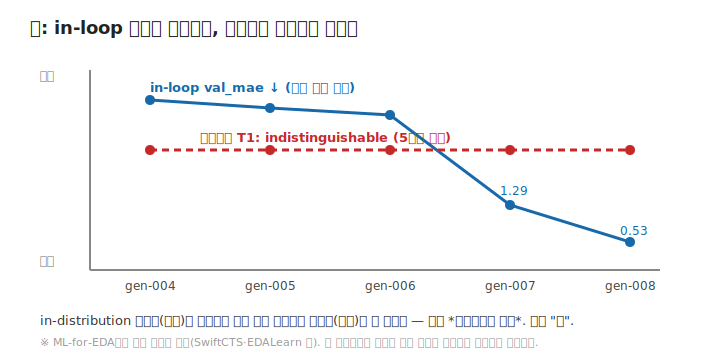

# 04 — 게이트와 벽 (capstone): 자율을 신뢰가능하게, 그리고 정직한 한계

이 레슨은 앞의 모든 개념이 만나는 지점입니다. [03](03-autoresearch-loop.md)의 자율 루프가 winner를
뽑으면, **무엇을 근거로 그 winner를 믿고 baseline으로 승격하나?** 그리고 5세대를 돌려 무엇을 배웠나?

## 4단 권력분립 게이트

자율 무인 승격을 *신뢰가능*하게 만드는 핵심은 **생성자(에이전트) ≠ 판정자**라는 권력분립입니다.
winner 후보는 네 단계를 *모두* 통과해야 승격되고, 한 단계라도 막히면 baseline이 유지됩니다.

- **① median** — 한 seed의 운 좋은 split에 속지 않게, 5 seed의 *중앙값* val_mae로 winner를 고릅니다.
  (gen-002가 단일 seed 위양성으로 걸린 뒤 도입.)
- **② LODO** (Leave-One-Design-Out) — [00 축 ②](00-orientation.md). 설계를 하나씩 통째로 빼서, winner가
  *처음 보는 설계*에서 baseline보다 후퇴하지 않는지 봅니다(방향성).
- **③ 교차설계 T1** — 그 격차가 *통계적으로 유의*한지 검정(반복 leave-one-design-out fold + Wilcoxon).
  LODO가 "누가 이겼나"라면 T1은 "그 차이가 noise를 넘나".
- **④ Codex** — 통계가 못 잡는 것(검증셋 누수, metric gaming)을 *다른 엔진*이 코드를 읽어 잡습니다.
  실제로 gen-003에서 검증셋 cherry-pick을 적발했습니다.

## 교차설계 일반화의 벽

이제 이 프로젝트가 5세대(gen-004~008)에 걸쳐 발견한 가장 견고한 사실입니다.

**in-loop `val_mae`는 세대마다 계속 낮아졌습니다**(gen-007 1.29 → gen-008 0.53, 역대 최저). 그런데
**교차설계 T1은 5세대 내내 `indistinguishable`**이었습니다. 즉 *익숙한 분포에서의 최적화*가 좋아져도
*처음 보는 설계로의 일반화*는 그대로였습니다. 둘은 **구조적으로 분리**됩니다 — 이게 "벽"입니다.

## 정직한 프레이밍 (중요)

이 벽을 "우리의 발견"이라 과장하면 안 됩니다. **"in-distribution 최적화 ≠ 교차설계 일반화"는
ML-for-EDA에서 이미 잘 알려진 현상**입니다 — 처음 보는 설계(out-of-distribution)에서 정확도가
떨어지는 건 문헌에 명시돼 있고(SwiftCTS 2026), 1% 셀 이동만으로 예측 혼잡도가 90%까지 출렁이는
취약성도 보고됐으며(NSF robustness), 설계 간 전이성을 재는 벤치마크(EDALearn)도 따로 존재합니다.

그래서 이 프로젝트의 *진짜 기여*는 발견이 아니라 **둘**입니다:
1. **자율 루프가 이 벽을 스스로 재현**했다 — 사람이 설계하지 않은 실험이 알려진 한계로 수렴.
2. **게이트가 위양성 승격을 막았다** — gen-002~008에서 "in-loop 최저"가 baseline을 오염시킬 뻔한
   순간을 5번 차단. 게이트의 가치는 *통과시킬 때*가 아니라 *낙관적 지표에 속지 않을 때* 증명됩니다.

> 승격 0건은 실패가 아니라, 4단 게이트가 정확히 작동했다는 증거입니다.

## 이 repo에선

- 4단 게이트 정의: [`../wiki/gate-chain.md`](../wiki/gate-chain.md)
- 세대 증거: [`../experiments/gen-004`](../experiments/gen-004) ~ [`gen-008`](../experiments/gen-008)
- 발견 누적 기록(날짜별): [`../INTENT.md`](../INTENT.md) Learnings

## 더 읽을거리

- 교차설계 estimator 정의(Xie 챕터): https://zhiyaoxie.com/files/chapter_route.pdf
- SwiftCTS — OOD/LODO 교차설계 일반화: https://arxiv.org/pdf/2606.11348v1.pdf
- ML-EDA 강건성·일반화(NSF): https://par.nsf.gov/servlets/purl/10626479
- EDALearn — 설계·공정 간 전이성 벤치마크: https://arxiv.org/pdf/2312.01674.pdf

## 이해 점검

1. LODO와 교차설계 T1은 각각 무엇을 보나? (방향성 vs 통계 유의)
2. 통계 게이트(T1)가 못 잡는 걸 Codex가 잡은 예는?
3. "승격 0건"이 왜 실패가 아니라 게이트가 작동한 증거인가?

## 다음

개념은 여기까지입니다. 이제 실제 세대별 실험을 보세요 →
[`../experiments/README.md`](../experiments/README.md) (gen-001~008 해설),
그리고 프로젝트 서사 전체는 [`../docs/TUTORIAL.md`](../docs/TUTORIAL.md).

---

← [03 AutoResearch 루프](03-autoresearch-loop.md) · [커리큘럼 처음으로](README.md)
