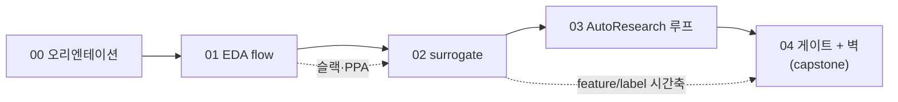

# tutorial/ — ML 개발자를 위한 반도체 설계 개념 커리큘럼

> **대상**: 머신러닝은 알지만(MAE·과적합·교차검증·통계 유의성·일반화) **반도체/EDA는 처음인** 개발자.
> 이 커리큘럼은 *이 저장소를 이해하는 데 필요한 개념*을 다이어그램 중심으로 단계별 설명합니다.

이 폴더는 **개념 교재**입니다. "이 프로젝트가 무엇을 했나"라는 *서사*는
[`../docs/TUTORIAL.md`](../docs/TUTORIAL.md), 세대별 실험 *해설*은
[`../experiments/README.md`](../experiments/README.md)에 있습니다 — 여기서는 그 문서들을 읽기 전에
필요한 *개념*을 먼저 잡습니다.

## 읽는 법

`00`부터 순서대로 읽으세요. 각 레슨은 ① 직관 → ② 다이어그램 → ③ "이 repo에선"(실제 파일 포인터)
→ ④ 더 읽을거리(검증된 출처) → ⑤ 이해 점검 으로 구성됩니다.

| # | 레슨 | 한 줄 |
|---|---|---|
| 00 | [오리엔테이션](00-orientation.md) | 이 repo가 한 일 한 장 + 당신이 새로 배울 2가지 축 |
| 01 | [반도체 EDA flow](01-eda-flow.md) | RTL→GDSII, 합성·배치·STA, **타이밍 슬랙**·PPA·routability |
| 02 | [Surrogate 모델](02-surrogate-models.md) | 왜 시뮬 대신 예측하나 · feature(합성직후)→label(최종) |
| 03 | [AutoResearch 루프](03-autoresearch-loop.md) | 연구를 검색으로 · 단일 `train.py` 변형 · 진화 루프 |
| 04 | [게이트와 벽 (capstone)](04-gates-and-the-wall.md) | 4단 권력분립 게이트 + 교차설계 일반화의 벽 |

## 기존 문서와의 관계

| 문서 | 역할 |
|---|---|
| `tutorial/` (여기) | **개념** — ML 개발자가 반도체 개념을 배움 |
| [`../docs/TUTORIAL.md`](../docs/TUTORIAL.md) | **서사** — 프로젝트가 무엇을 했고 무엇을 발견했나 + 용어 사전 |
| [`../experiments/README.md`](../experiments/README.md) | **세대 해설** — gen-001~008 각 실험 |
| [`../wiki/gate-chain.md`](../wiki/gate-chain.md) | 4단 게이트 정의 |

## 개념 의존 그래프

